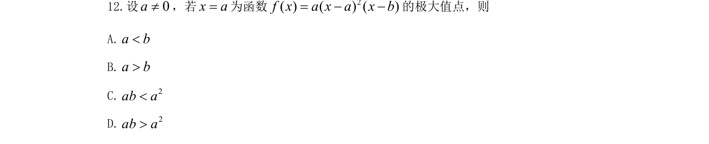
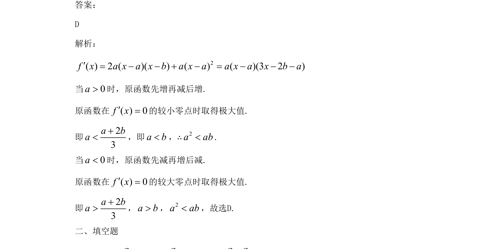

## 题面

## 摘要

该题考查含参三次函数的极值点条件，通过求导与分类讨论确定参数关系。

## 关联考点

- [[548-导数与极值|导数与极值]]
- [[600-三次函数|三次函数]]
- [[424-参数分类讨论|分类讨论]]

## 答案与解析

> 📄 原 PDF 第 7 页：`素材/真题/吉林/2008-2024·（吉林）数学高考真题/2021年高考数学试卷（文）（全国乙卷）（新课标Ⅰ）（解析卷）.pdf`

<!-- 题干文本-start -->
## 题干文本
12.设0a¹，若x a=为函数 2( ) ( ) ( )f x a x a x b= - -的极大值点，则
A.a b<
B.a b>
C. 2ab a<
D. 2ab a>
答案：
D
解析：
2()2()()()()(32)fxaxaxbaxaaxaxba¢=--+-=---
当0a>时，原函数先增再减后增.
原函数在( ) 0f x¢=的较小零点时取得极大值.
即23a ba+<，即a b<，∴2a ab<.
当0a<时，原函数先减再增后减.
原函数在()0fx¢=的较大零点时取得极大值.
即23a ba+>，a b>，2a ab<，故选D.
二、填空题
<!-- 题干文本-end -->

<!-- 解析文本-start -->
## 解析文本

<!-- 解析文本-end -->
