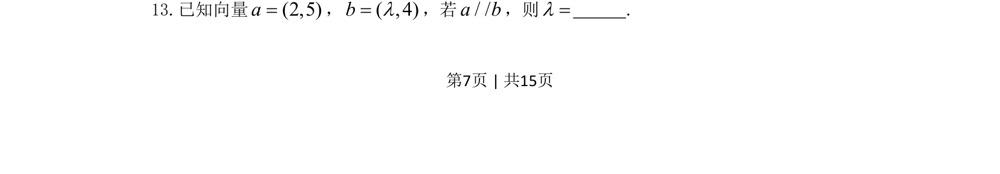
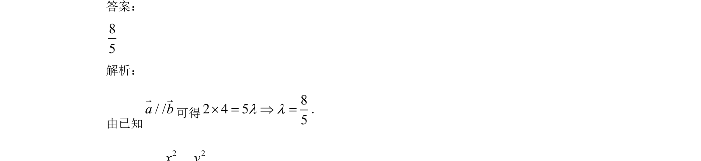

## 题面

## 摘要

考查平面向量平行的坐标条件，通过坐标比例关系求参数λ。

## 关联考点

- [[854-平面向量|平面向量]]
- [[750-向量平行|向量平行]]
- [[789-坐标运算|坐标运算]]

## 答案与解析

> 📄 原 PDF 第 7 页：`素材/真题/吉林/2008-2024·（吉林）数学高考真题/2021年高考数学试卷（文）（全国乙卷）（新课标Ⅰ）（解析卷）.pdf`
