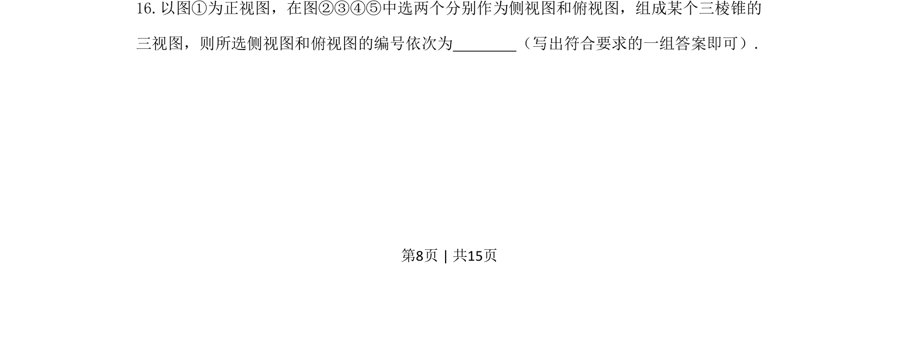
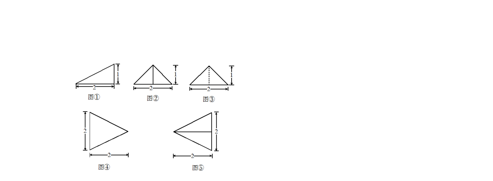
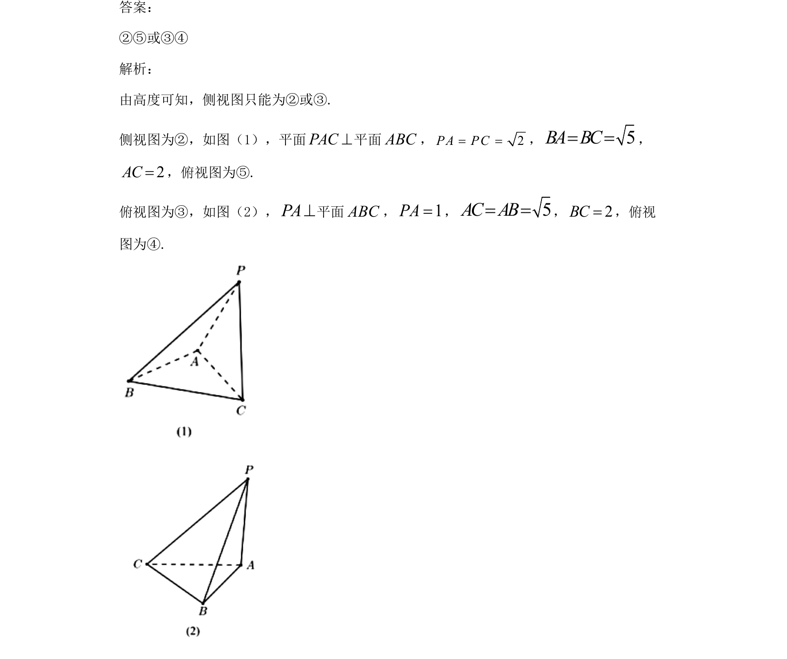

## 题面

## 摘要

根据给定正视图，选择正确的侧视图和俯视图编号，以构成完整的三棱锥三视图。

## 关联考点

- [[235-三视图|三视图]]
- [[1045-空间几何体|空间几何体]]
- [[599-三棱锥|三棱锥]]

## 答案与解析

> 📄 原 PDF 第 8 页：`素材/真题/吉林/2008-2024·（吉林）数学高考真题/2021年高考数学试卷（文）（全国乙卷）（新课标Ⅰ）（解析卷）.pdf`

<!-- 题干文本-start -->
## 题干文本
16.以图①为正视图，在图②③④⑤中选两个分别作为侧视图和俯视图，组成某个三棱锥的
三视图，则所选侧视图和俯视图的编号依次为        （写出符合要求的一组答案即可）.
<!-- 题干文本-end -->

<!-- 解析文本-start -->
## 解析文本

<!-- 解析文本-end -->
