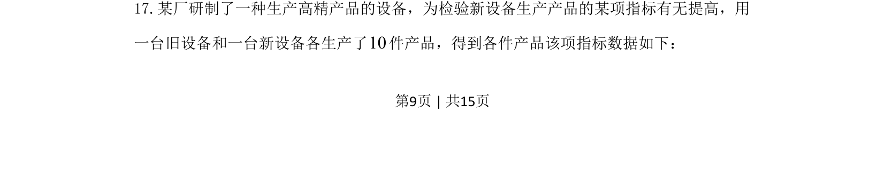
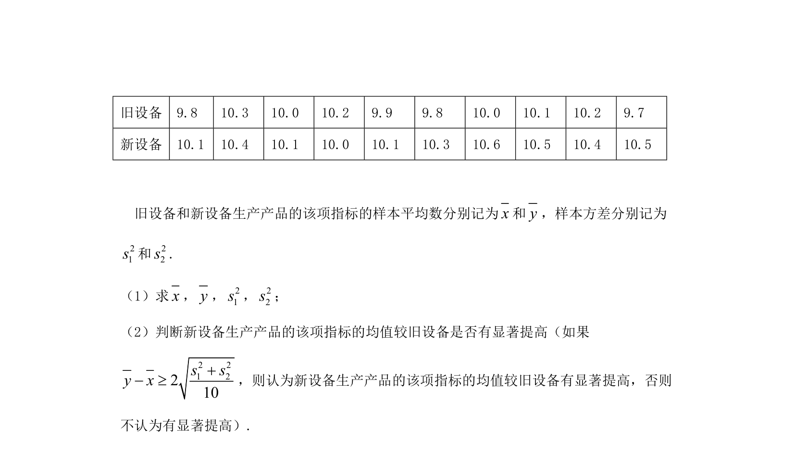
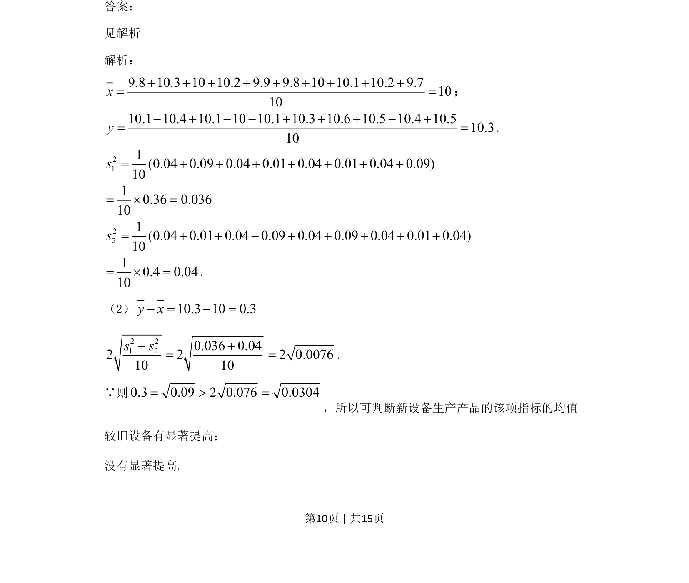

## 题面

## 摘要

新旧设备各10件产品指标比较，检验新设备是否提高指标，属于两样本均值比较的假设检验问题。

## 关联考点

- [[508-统计推断|假设检验]]
- [[1359-均值比较|均值比较]]
- [[587-统计量|统计量]]

## 答案与解析

> 📄 原 PDF 第 9 页：`素材/真题/吉林/2008-2024·（吉林）数学高考真题/2021年高考数学试卷（文）（全国乙卷）（新课标Ⅰ）（解析卷）.pdf`
