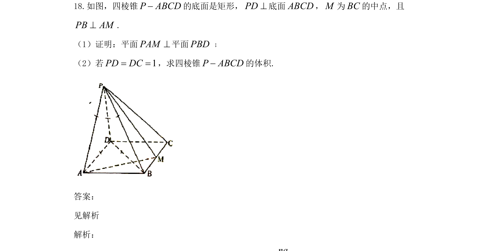

## 题面

## 摘要

本题考查四棱锥中的线面垂直与面面垂直证明，并结合体积计算。

## 关联考点

- [[351-空间直线平面垂直|线面垂直]]
- [[351-空间直线平面垂直|面面垂直]]
- [[体积计算]]
- [[401-空间向量基本概念|空间向量]]

## 答案与解析

> 📄 原 PDF 第 11 页：`素材/真题/吉林/2008-2024·（吉林）数学高考真题/2021年高考数学试卷（文）（全国乙卷）（新课标Ⅰ）（解析卷）.pdf`
