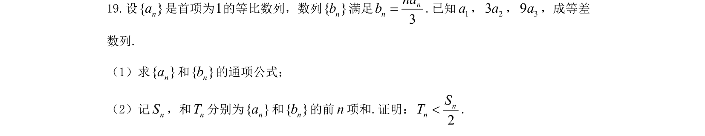
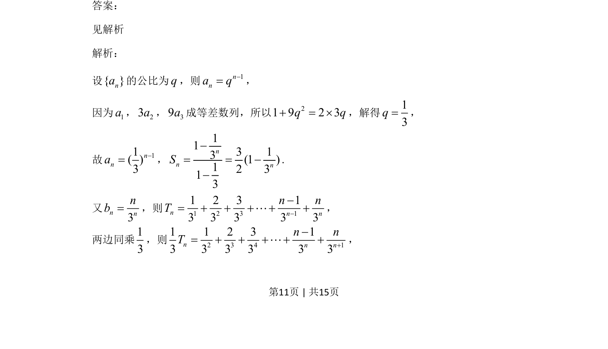
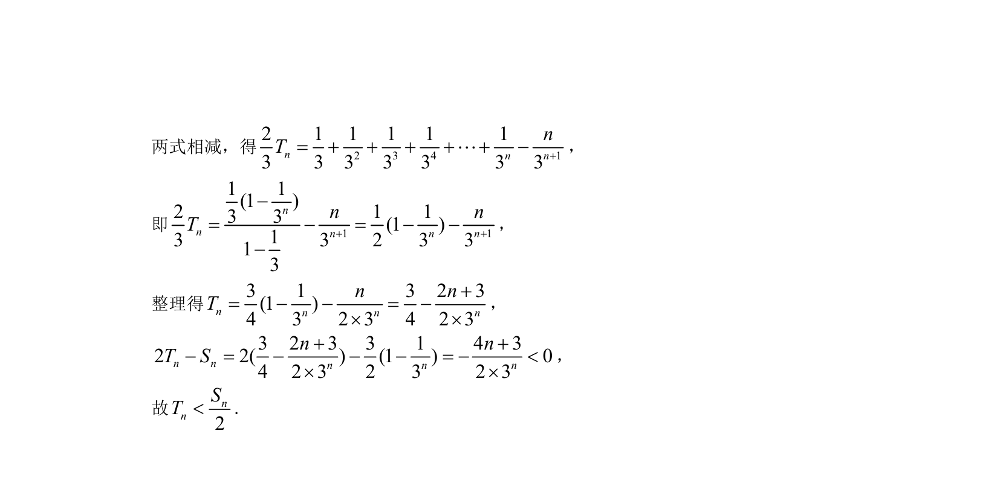

## 题面

## 摘要

本题考查等比数列通项与求和、等差数列性质及错位相减法证明不等式。

## 关联考点

- [[358-等比数列概念|等比数列]]
- [[356-等差数列概念|等差数列]]
- [[385-数列错位相减|错位相减法]]
- [[数列不等式]]

## 答案与解析

> 📄 原 PDF 第 11 页：`素材/真题/吉林/2008-2024·（吉林）数学高考真题/2021年高考数学试卷（文）（全国乙卷）（新课标Ⅰ）（解析卷）.pdf`
