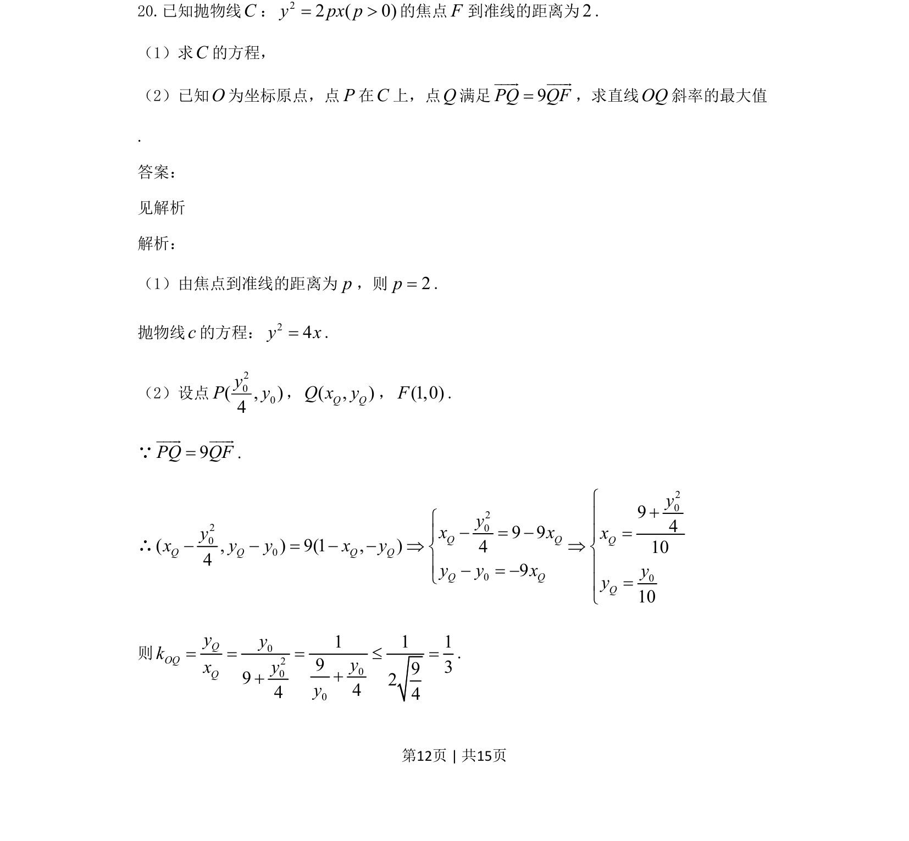
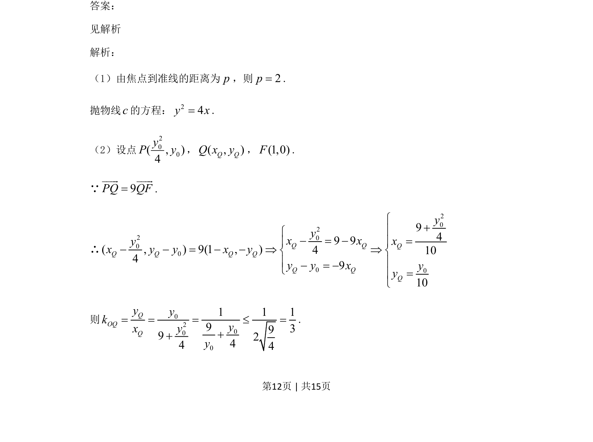
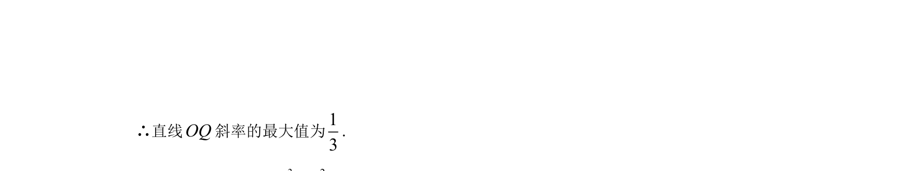

## 题面

## 摘要

抛物线定义求方程，结合向量关系求动点坐标，再求直线斜率最值。

## 关联考点

- [[875-抛物线方程|抛物线方程]]
- [[541-向量坐标运算|向量坐标运算]]
- [[903-斜率最值|斜率最值]]
- [[295-基本不等式|基本不等式]]

## 答案与解析

> 📄 原 PDF 第 12 页：`素材/真题/吉林/2008-2024·（吉林）数学高考真题/2021年高考数学试卷（文）（全国乙卷）（新课标Ⅰ）（解析卷）.pdf`
