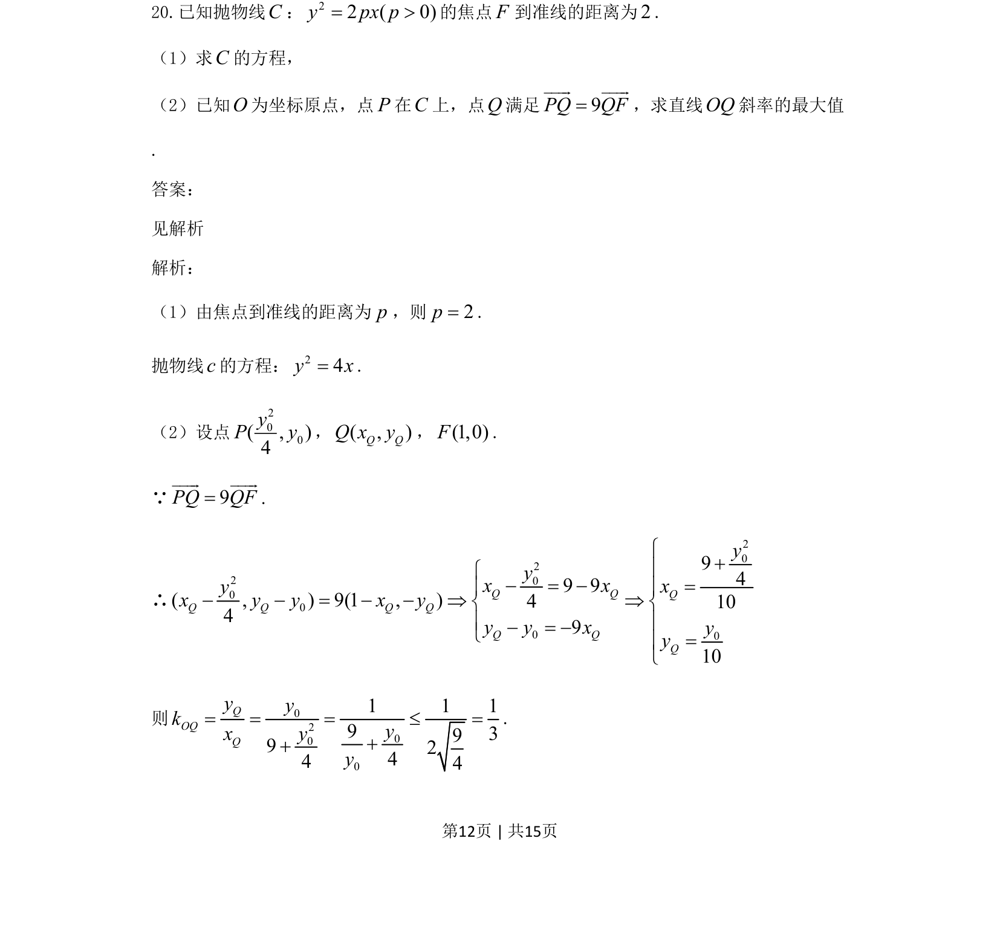
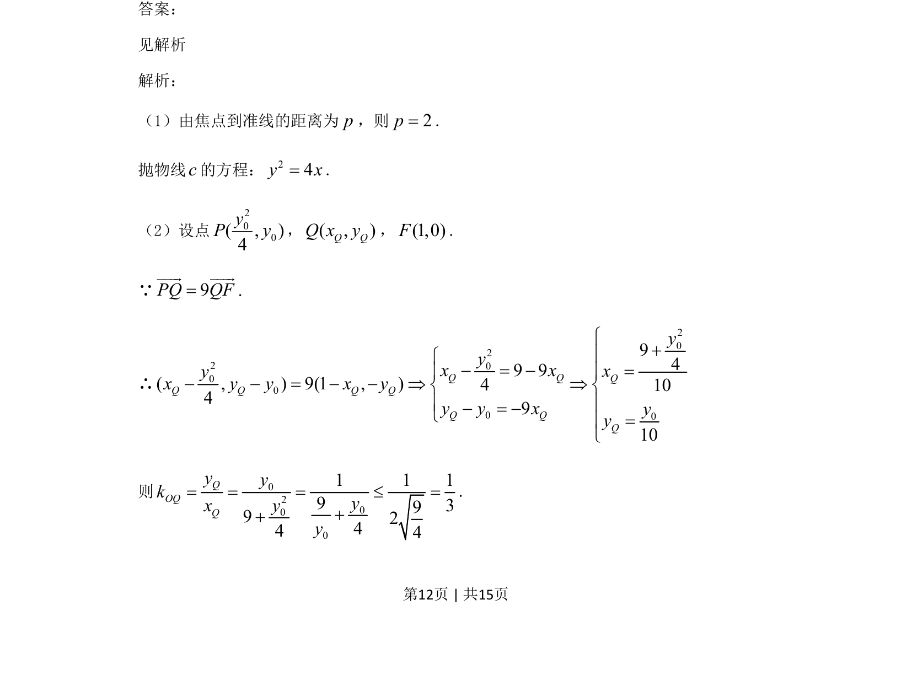

## 题面

## 摘要

抛物线定义求方程，结合向量关系求动点坐标，再求直线斜率最值。

## 关联考点

- [[875-抛物线方程|抛物线方程]]
- [[541-向量坐标运算|向量坐标运算]]
- [[903-斜率最值|斜率最值]]
- [[295-基本不等式|基本不等式]]

## 答案与解析

> 📄 原 PDF 第 12 页：`素材/真题/吉林/2008-2024·（吉林）数学高考真题/2021年高考数学试卷（文）（全国乙卷）（新课标Ⅰ）（解析卷）.pdf`

<!-- 题干文本-start -->
## 题干文本
20.已知抛物线C：22(0)ypxp=>的焦点F到准线的距离为2.
（1）求C的方程，
（2）已知O为坐标原点，点P在C上，点Q满足9PQQF=υυυrυυυr
，求直线OQ斜率的最大值
.
答案：
见解析
解析：
（1）由焦点到准线的距离为p，则2p=.
抛物线c的方程：24y x=.
（2）设点
200( , )4yP y，( , )Q QQ x y，(1,0)F.
∵9PQ QF=υυυ r υυυ r
.
∴
2022 000009499(,)9(1,)4104910QQQQQQQQQQyyxxxyxyyxyyyxyy+-=-=--=--⇒⇒-=-=
则 020001 1 193992444QOQQyykyyxy= = = ≤ =++
.
<!-- 题干文本-end -->

<!-- 解析文本-start -->
## 解析文本

<!-- 解析文本-end -->
