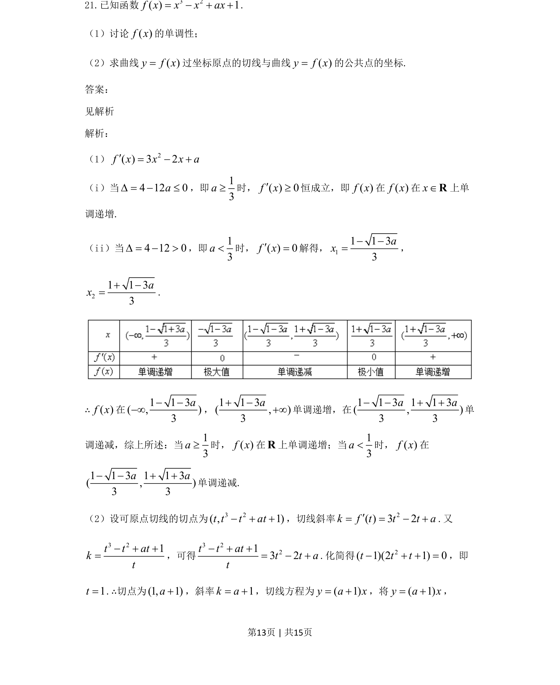

## 题面

## 摘要

已知三次函数解析式，讨论其单调性并求过原点的切线与曲线的公共点坐标。

## 关联考点

- [[导数与单调性]]
- [[422-切线方程|切线方程]]
- [[参数讨论]]

## 答案与解析

> 📄 原 PDF 第 13 页：`素材/真题/吉林/2008-2024·（吉林）数学高考真题/2021年高考数学试卷（文）（全国乙卷）（新课标Ⅰ）（解析卷）.pdf`
