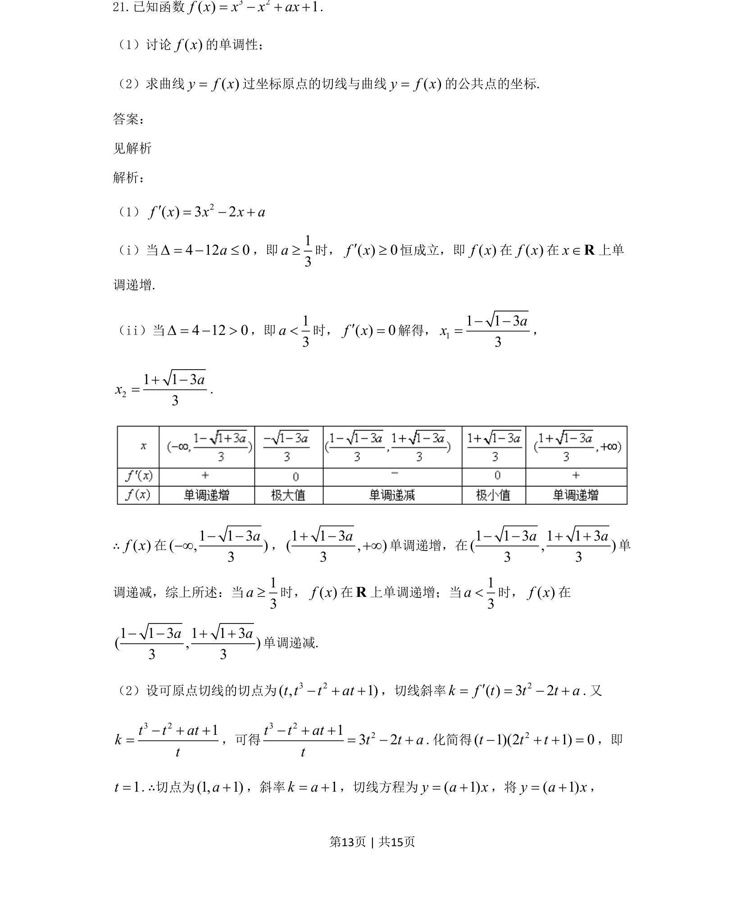
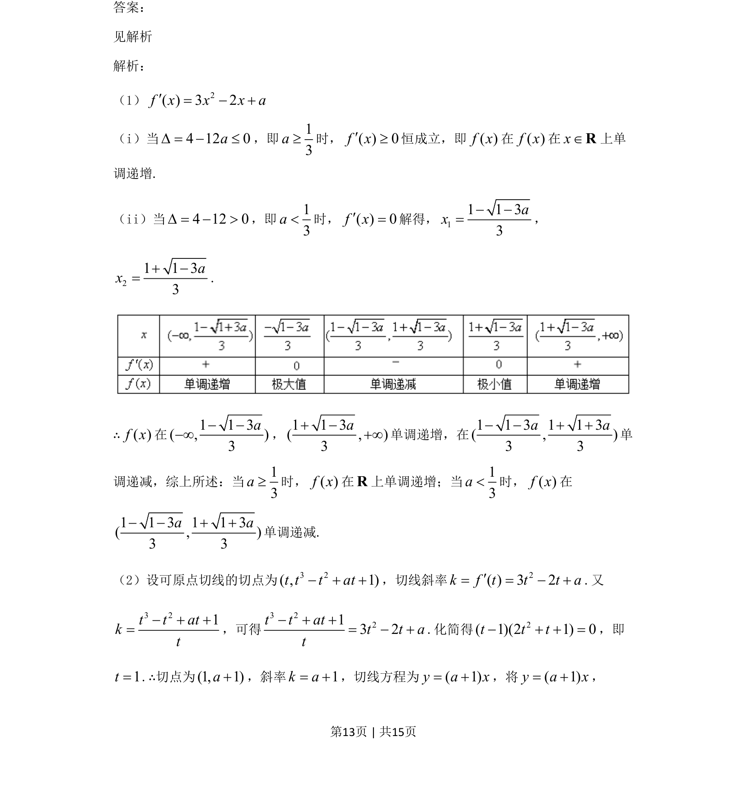
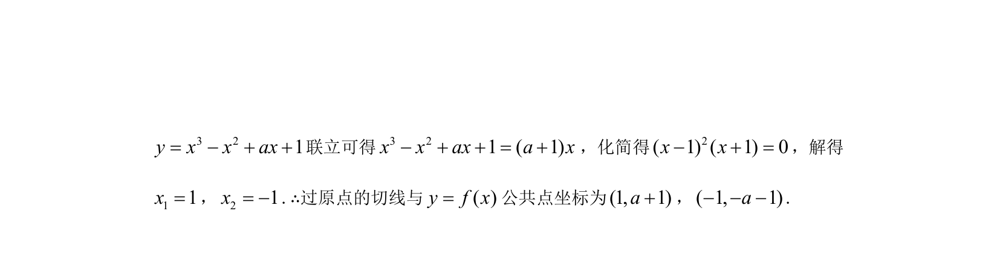

## 题面

## 摘要

已知三次函数解析式，讨论其单调性并求过原点的切线与曲线的公共点坐标。

## 关联考点

- [[705-利用导数研究函数的单调性|导数与单调性]]
- [[422-切线方程|切线方程]]
- [[594-参数讨论|参数讨论]]

## 答案与解析

> 📄 原 PDF 第 13 页：`素材/真题/吉林/2008-2024·（吉林）数学高考真题/2021年高考数学试卷（文）（全国乙卷）（新课标Ⅰ）（解析卷）.pdf`

<!-- 题干文本-start -->
## 题干文本
21.已知函数 3 2( ) 1f x x x ax= - + +.
（1）讨论()fx的单调性；
（2）求曲线()yfx=过坐标原点的切线与曲线()yfx=的公共点的坐标.
答案：
见解析
解析：
（1） 2()32fxxxa¢=-+
（i）当4120aD=-≤，即13a³时，()0fx¢³恒成立，即()fx在()fx在xÎR上单
调递增.
（ii）当4120D=->，即13a<时，()0fx¢=解得，11133ax--=，
21133ax+-=.
∴()fx在113(,)3a---∞，113(,)3a+-+∞单调递增，在113113(,)33aa--++单
调递减，综上所述：当13a³时，()fx在R上单调递增；当13a<时，()fx在
113113(,)33aa--++单调递减.
（2）设可原点切线的切点为32(,1)tttat-++，切线斜率 2()32kfttta¢==-+.又
321ttatkt-++=，可得
3 2213 2t t att t at- + += - +.化简得 2(1)(21)0ttt-++=，即
1t=.∴切点为(1,1)a+，斜率1ka=+，切线方程为(1)yax=+，将(1)yax=+，
<!-- 题干文本-end -->

<!-- 解析文本-start -->
## 解析文本

<!-- 解析文本-end -->
