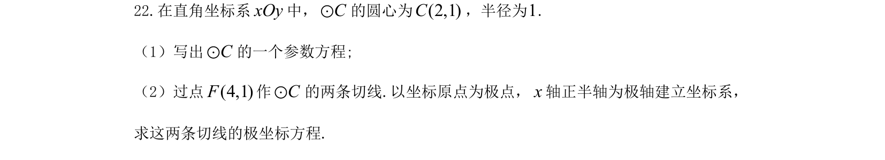
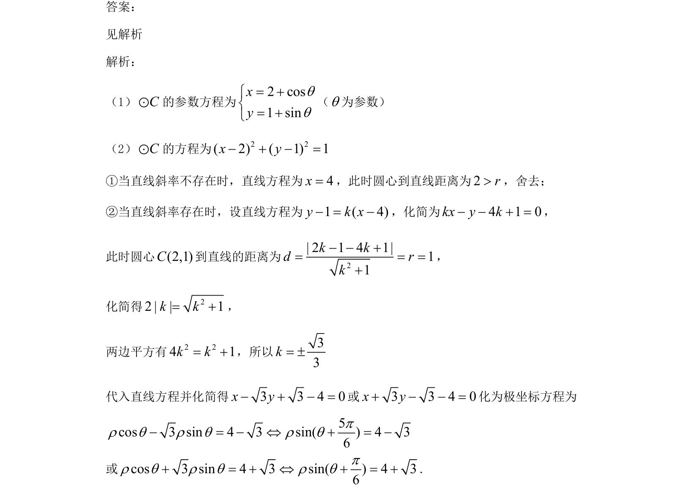

## 题面

## 摘要

本题考查圆的参数方程、过圆外一点的切线方程及直角坐标方程与极坐标方程的转化。

## 关联考点

- [[544-圆的参数方程|圆的参数方程]]
- [[422-切线方程|切线方程]]
- [[1211-点到直线距离|点到直线距离]]
- [[921-极坐标方程|极坐标方程]]

## 答案与解析

> 📄 原 PDF 第 14 页：`素材/真题/吉林/2008-2024·（吉林）数学高考真题/2021年高考数学试卷（文）（全国乙卷）（新课标Ⅰ）（解析卷）.pdf`
