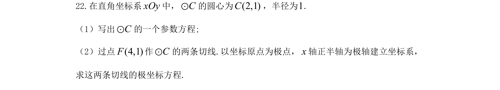
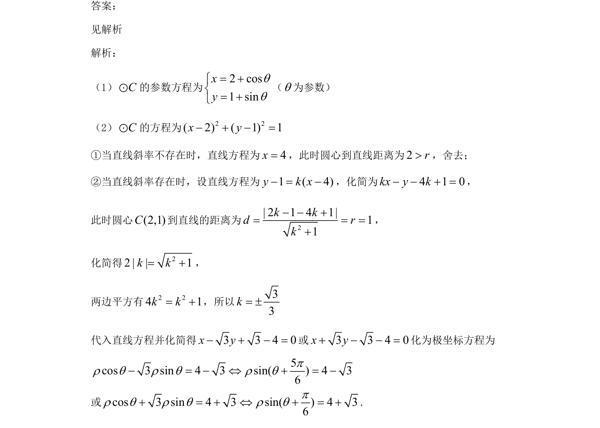

## 题面

## 摘要

本题考查圆的参数方程、过圆外一点的切线方程及直角坐标方程与极坐标方程的转化。

## 关联考点

- [[544-圆的参数方程|圆的参数方程]]
- [[422-切线方程|切线方程]]
- [[1211-点到直线距离|点到直线距离]]
- [[921-极坐标方程|极坐标方程]]

## 答案与解析

> 📄 原 PDF 第 14 页：`素材/真题/吉林/2008-2024·（吉林）数学高考真题/2021年高考数学试卷（文）（全国乙卷）（新课标Ⅰ）（解析卷）.pdf`

<!-- 题干文本-start -->
## 题干文本
22.在直角坐标系xOy中，C的圆心为)(2,1C，半径为1.
（1）写出C的一个参数方程;
（2）过点)(4,1F作C的两条切线.以坐标原点为极点，x轴正半轴为极轴建立坐标系，
求这两条切线的极坐标方程.
答案：
见解析
解析：
（1）C的参数方程为
2 cos1 sinxyqq= += +
（q为参数）
（2）C的方程为 2 2( 2) ( 1) 1x y- + - =
①当直线斜率不存在时，直线方程为4x=，此时圆心到直线距离为2r>，舍去；
②当直线斜率存在时，设直线方程为1 ( 4)y k x- = -，化简为4 1 0kx y k- - + =，
此时圆心(2,1)C到直线的距离为 2| 2 1 4 1|11k kd rk- - += = =+
，
化简得 22 | | 1k k= +，
两边平方有2 24 1k k= +，所以33k= ±
代入直线方程并化简得3 3 4 0x y- + - =或3 3 4 0x y+ - - =化为极坐标方程为
5cos 3 sin 4 3 sin( ) 4 36pr q r q r q- = - Û + = -
或cos 3 sin 4 3 sin( ) 4 36pr q r q r q+ = + Û + = +.
<!-- 题干文本-end -->

<!-- 解析文本-start -->
## 解析文本

<!-- 解析文本-end -->
