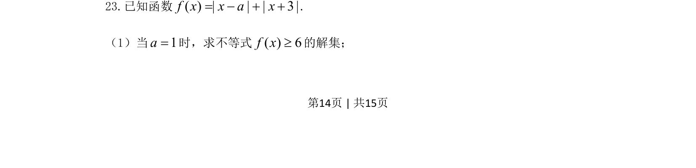
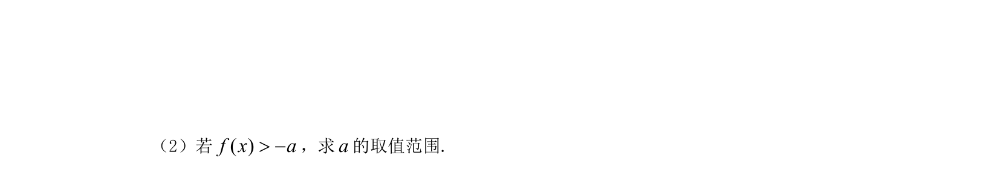
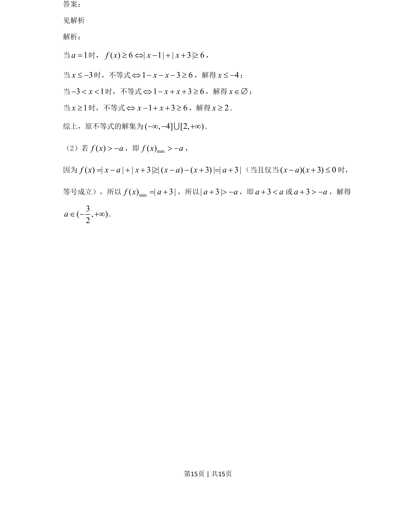

## 题面

## 摘要

本题考查含绝对值的不等式求解，通过代入参数并分类讨论求交集。

## 关联考点

- [[1093-绝对值不等式|绝对值不等式]]
- [[424-参数分类讨论|分类讨论]]

## 答案与解析

> 📄 原 PDF 第 14 页：`素材/真题/吉林/2008-2024·（吉林）数学高考真题/2021年高考数学试卷（文）（全国乙卷）（新课标Ⅰ）（解析卷）.pdf`
