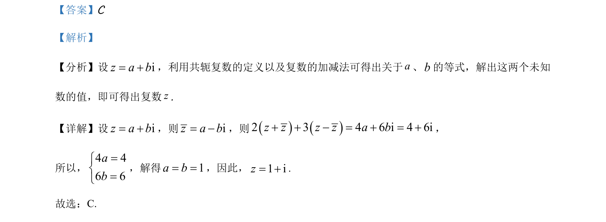

## 题面

## 摘要

通过设复数的代数形式，利用共轭关系与运算等式求解未知数，确定复数。

## 关联考点

- [[801-复数代数形式|复数代数形式]]
- [[534-共轭复数|共轭复数]]
- [[802-复数加减法|复数加减法]]
- [[197-待定系数法|待定系数法]]

## 答案与解析

> 📄 原 PDF 第 1 页：`素材/真题/吉林/2008-2024·（吉林）数学高考真题/2021年高考数学试卷（理）（全国乙卷）（新课标Ⅰ）（解析卷）.pdf`

<!-- 题干文本-start -->
## 题干文本
1. 设2 3 4 6iz z z z+ + - = +，则z=（    ）
A. 1 2i-B. 1 2i+C. 1 i+D. 1 i-
<!-- 题干文本-end -->

<!-- 解析文本-start -->
## 解析文本
【答案】C
【解析】
【分析】设iz a b= +，利用共轭复数的定义以及复数的加减法可得出关于a、b的等式，解出这两个未知
数的值，即可得出复数z.
【详解】设iz a b= +，则iz a b= -，则2 3 4 6 i 4 6iz z z z a b+ + - = + = +，
所以，
4 46 6ab=ìí=î
，解得1a b= =，因此，1 iz= +.
故选：C.
<!-- 解析文本-end -->
