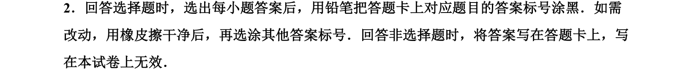

## 题面

## 摘要

该题考查集合包含关系与交集运算，并涉及全称命题与存在性命题的真假判断。

## 关联考点

- [[集合包含关系]]
- [[交集运算]]
- [[280-全称量词与存在量词|全称量词与存在量词]]
- [[命题真假判断]]

## 答案与解析

> 📄 原 PDF 第 1 页：`素材/真题/吉林/2008-2024·（吉林）数学高考真题/2021年高考数学试卷（理）（全国乙卷）（新课标Ⅰ）（解析卷）.pdf`
