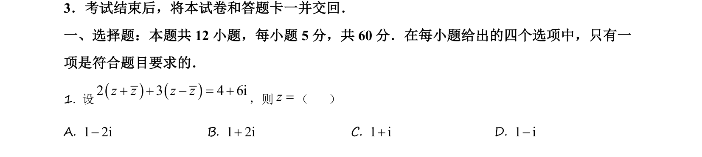
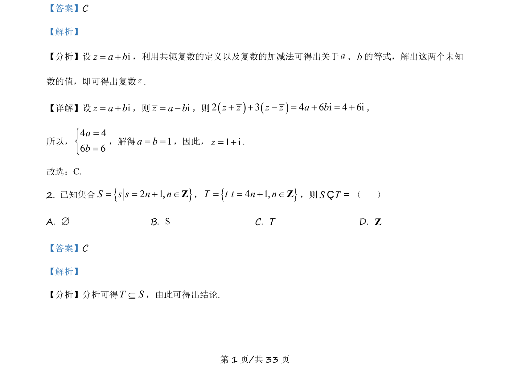
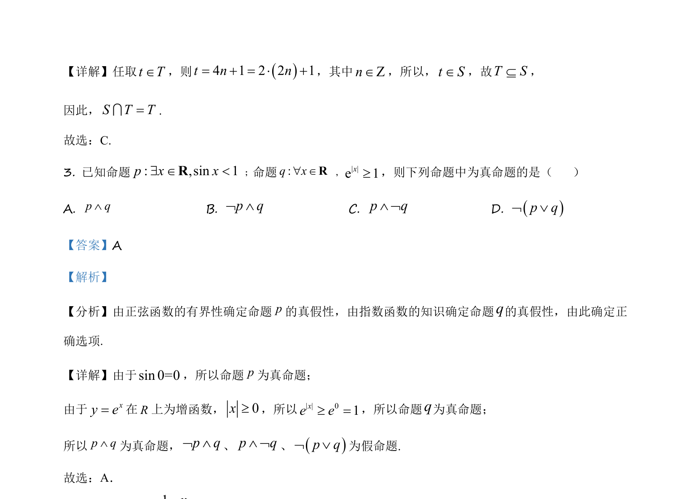

## 题面

## 摘要

判断正弦与指数函数相关命题的真假，并用逻辑联结词确定复合命题的真值。

## 关联考点

- [[命题真假判断]]
- [[正弦函数有界性]]
- [[指数函数单调性]]
- [[逻辑联结词]]

## 答案与解析

> 📄 原 PDF 第 1 页：`素材/真题/吉林/2008-2024·（吉林）数学高考真题/2021年高考数学试卷（理）（全国乙卷）（新课标Ⅰ）（解析卷）.pdf`
