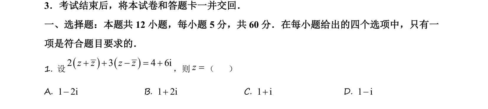
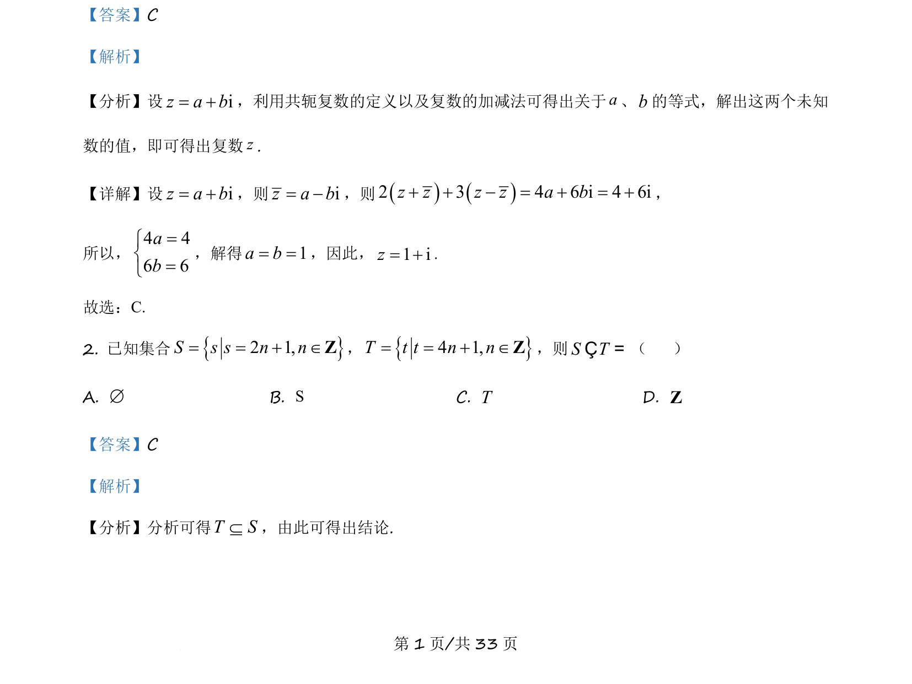

## 题面

## 摘要

判断正弦与指数函数相关命题的真假，并用逻辑联结词确定复合命题的真值。

## 关联考点

- [[765-命题真假判断|命题真假判断]]
- [[960-正弦函数有界性|正弦函数有界性]]
- [[553-指数函数单调性|指数函数单调性]]
- [[1130-逻辑联结词|逻辑联结词]]

## 答案与解析

> 📄 原 PDF 第 2 页：`素材/真题/吉林/2008-2024·（吉林）数学高考真题/2021年高考数学试卷（理）（全国乙卷）（新课标Ⅰ）（解析卷）.pdf`

<!-- 题干文本-start -->
## 题干文本
3. 已知命题: ,sin 1p x x$ Î <R﹔命题:q x" ÎR﹐| |e 1x³，则下列命题中为真命题的是（    ）
A. p qÙB. p qØ ÙC. p qÙ ØD. p qØ Ú
<!-- 题干文本-end -->

<!-- 解析文本-start -->
## 解析文本
【答案】A
【解析】
【分析】由正弦函数的有界性确定命题p的真假性，由指数函数的知识确定命题q的真假性，由此确定正
确选项.
【详解】由于sin 0=0，所以命题p为真命题；
由于xy e=在R上为增函数，0x³，所以| | 01xe e³ =，所以命题q为真命题；
所以p qÙ为真命题，p qØ Ù、p qÙ Ø、p qØ Ú为假命题.
故选：A．
<!-- 解析文本-end -->
