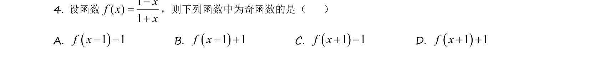
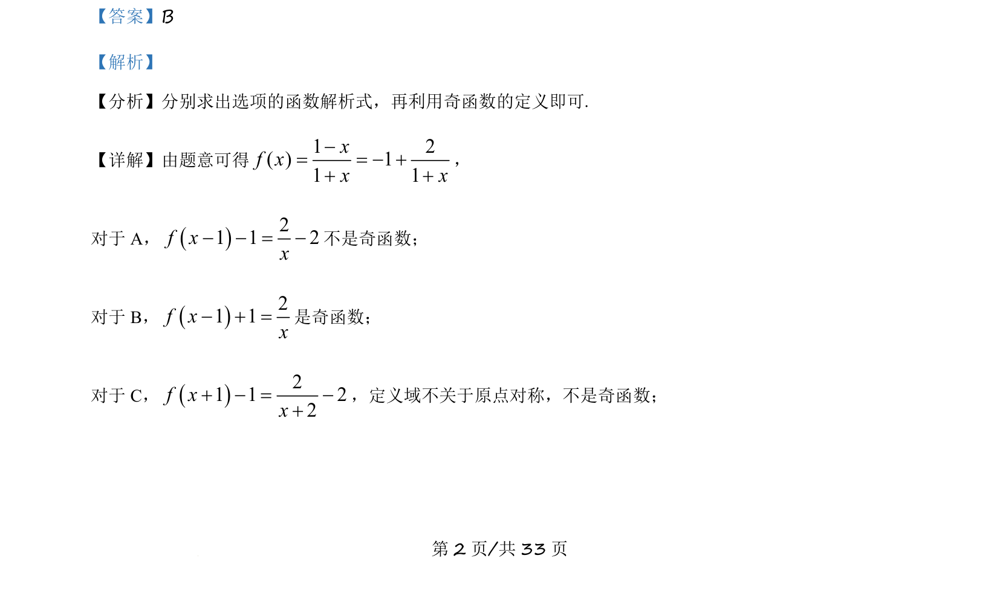
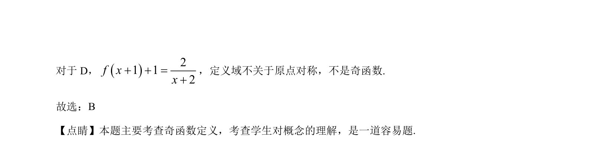

## 题面

## 摘要

本题通过解析式判断函数奇偶性，结合定义域对称性筛选选项。

## 关联考点

- [[819-奇函数定义|奇函数定义]]
- [[014-对称|定义域对称性]]

## 答案与解析

> 📄 原 PDF 第 2 页：`素材/真题/吉林/2008-2024·（吉林）数学高考真题/2021年高考数学试卷（理）（全国乙卷）（新课标Ⅰ）（解析卷）.pdf`

<!-- 题干文本-start -->
## 题干文本
4. 设函数1( )1xf xx-=+
，则下列函数中为奇函数的是（    ）
A. ()1 1f x- -B. ()1 1f x- +C. ()1 1f x+ -D. ()1 1f x+ +
<!-- 题干文本-end -->

<!-- 解析文本-start -->
## 解析文本
【答案】B
【解析】
【分析】分别求出选项的函数解析式，再利用奇函数的定义即可.
【详解】由题意可得1 2( ) 11 1xf xx x-= = - ++ +
，
对于 A，()21 1 2f xx- - = -不是奇函数；
对于 B，()21 1f xx- =+是奇函数；
对于 C，()21 1 22f xx+ - = -+
，定义域不关于原点对称，不是奇函数；
<!-- 解析文本-end -->
