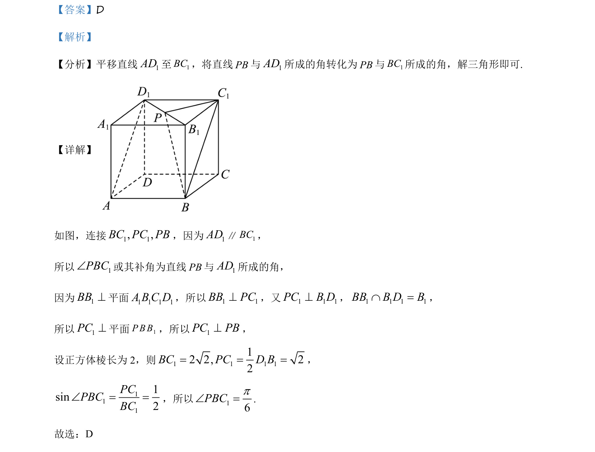

## 题面

## 摘要

本题考查在正方体中通过平移法求异面直线所成角，并利用线面垂直构造直角三角形求解正弦值。

## 关联考点

- [[353-空间角|异面直线所成角]]
- [[平移法]]
- [[351-空间直线平面垂直|线面垂直]]
- [[解三角形]]

## 答案与解析

> 📄 原 PDF 第 3 页：`素材/真题/吉林/2008-2024·（吉林）数学高考真题/2021年高考数学试卷（理）（全国乙卷）（新课标Ⅰ）（解析卷）.pdf`
