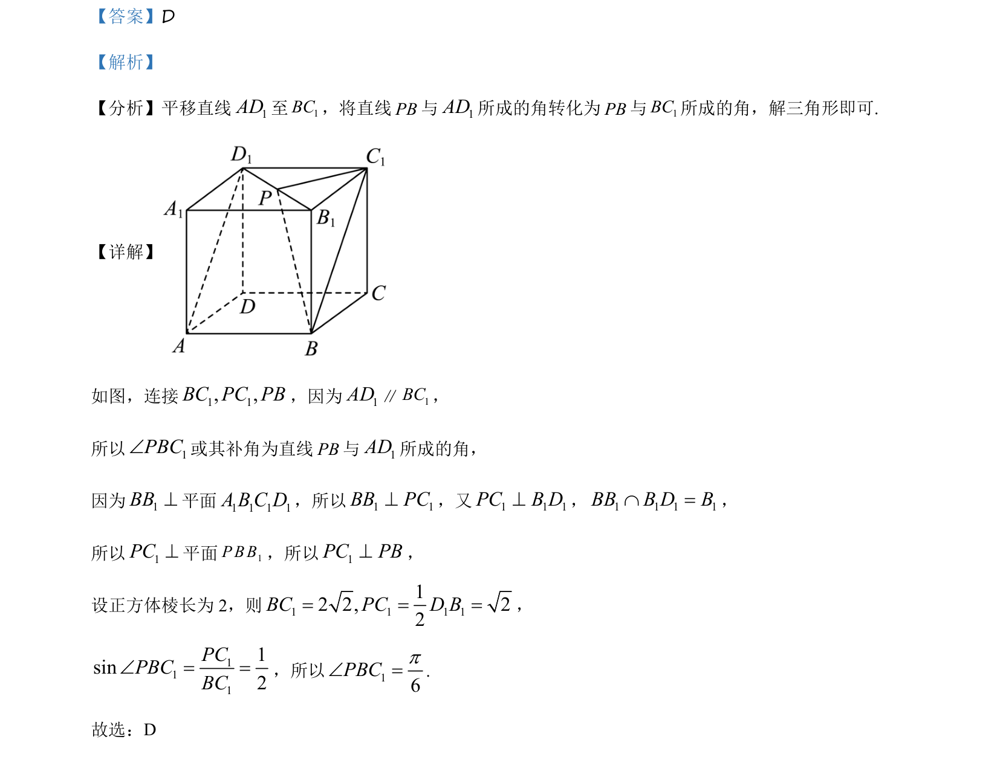

## 题面

## 摘要

本题考查在正方体中通过平移法求异面直线所成角，并利用线面垂直构造直角三角形求解正弦值。

## 关联考点

- [[353-空间角|异面直线所成角]]
- [[846-平移法|平移法]]
- [[351-空间直线平面垂直|线面垂直]]
- [[589-解三角形|解三角形]]

## 答案与解析

> 📄 原 PDF 第 3 页：`素材/真题/吉林/2008-2024·（吉林）数学高考真题/2021年高考数学试卷（理）（全国乙卷）（新课标Ⅰ）（解析卷）.pdf`

<!-- 题干文本-start -->
## 题干文本
5. 在正方体 1 1 1 1ABCD A B C D-中，P为1 1B D的中点，则直线PB与1AD所成的角为（    ）
A. π2
B. π3
C. π4
D. π6
<!-- 题干文本-end -->

<!-- 解析文本-start -->
## 解析文本
【答案】D
【解析】
【分析】平移直线1AD至1BC，将直线PB与1AD所成的角转化为PB与1BC所成的角，解三角形即可.
【详解】
如图，连接1 1, ,BC PC PB，因为1AD∥1BC，
所以 1PBCÐ或其补角为直线PB与1AD所成的角，
因为1BB^平面 1111DCBA，所以1 1BB PC^，又1 1 1PC B D^，1 1 1 1BB B D BÇ =，
所以1PC^平面 1P B B，所以1PC PB^，
设正方体棱长为 2，则1 1 1 112 2, 22BC PC D B= = =，
1111sin2PCPBCBCÐ = =，所以 16PBCpÐ =.
故选：D
<!-- 解析文本-end -->
