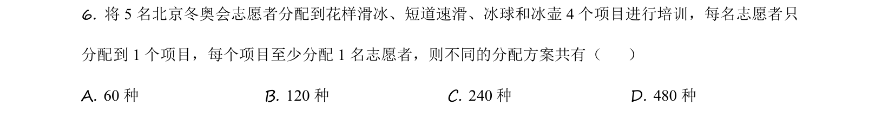
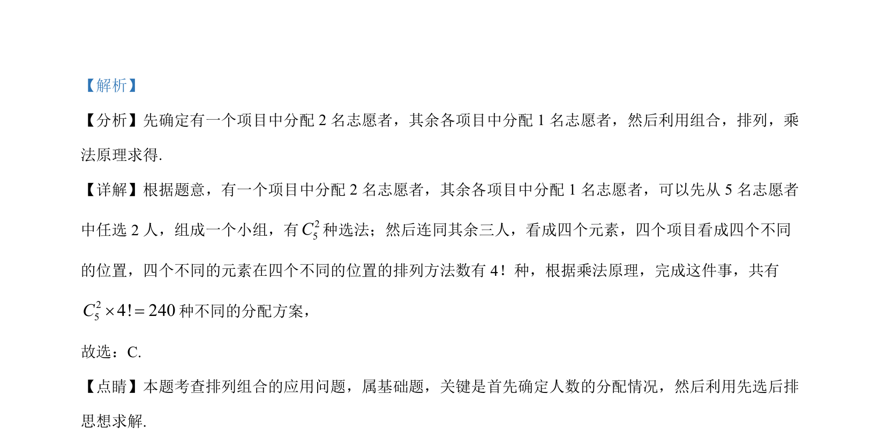

## 题面

## 摘要

本题考查分组分配问题，先确定人数分配，再用先选后排思想求解。

## 关联考点

- [[487-排列概念|排列]]
- [[505-组合概念|组合]]
- [[699-分组分配|分组分配]]
- [[477-分步计数原理|乘法原理]]

## 答案与解析

> 📄 原 PDF 第 3 页：`素材/真题/吉林/2008-2024·（吉林）数学高考真题/2021年高考数学试卷（理）（全国乙卷）（新课标Ⅰ）（解析卷）.pdf`
