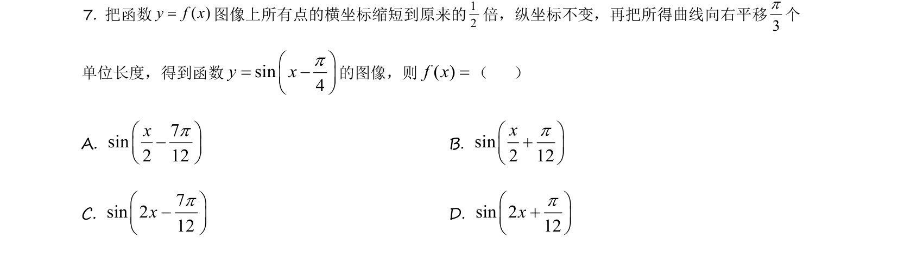
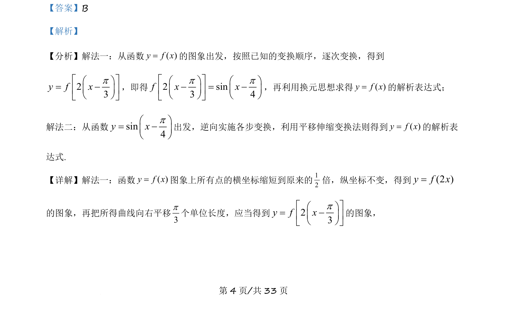
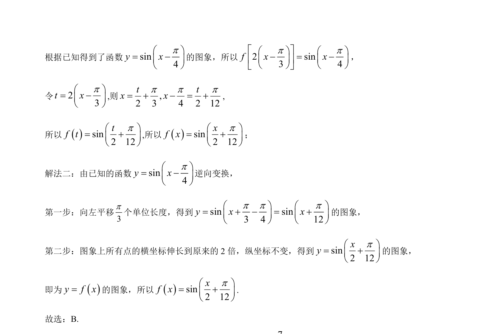

## 题面

## 摘要

考察三角函数的图像变换（伸缩与平移）及逆向还原解析式。

## 关联考点

- [[269-三角函数图象变换|三角函数的图像变换]]
- [[693-函数解析式|函数解析式]]
- [[885-换元思想|换元思想]]

## 答案与解析

> 📄 原 PDF 第 4 页：`素材/真题/吉林/2008-2024·（吉林）数学高考真题/2021年高考数学试卷（理）（全国乙卷）（新课标Ⅰ）（解析卷）.pdf`

<!-- 题干文本-start -->
## 题干文本
7. 把函数( )y f x=图像上所有点的横坐标缩短到原来的12倍，纵坐标不变，再把所得曲线向右平移3p个
单位长度，得到函数sin4y xpæ ö= -ç ÷è ø
的图像，则( )f x=（    ）
A. 
7sin2 12xpæ ö-ç ÷è ø
B. sin2 12xpæ ö+ç ÷è ø
C. 
7sin 212xpæ ö-ç ÷è ø
D. sin 212xpæ ö+ç ÷è ø
<!-- 题干文本-end -->

<!-- 解析文本-start -->
## 解析文本
【答案】B
【解析】
【分析】解法一：从函数( )y f x=的图象出发，按照已知的变换顺序，逐次变换，得到
23y f xpé ùæ ö= -ç ÷ê úè øë û
，即得2 sin3 4f x xp pé ùæ ö æ ö- = -ç ÷ ç ÷ê úè ø è øë û
，再利用换元思想求得( )y f x=的解析表达式；
解法二：从函数sin4y xpæ ö= -ç ÷è ø
出发，逆向实施各步变换，利用平移伸缩变换法则得到( )y f x=的解析表
达式.
【详解】解法一：函数( )y f x=图象上所有点的横坐标缩短到原来的12倍，纵坐标不变，得到(2 )y f x=
的图象，再把所得曲线向右平移3p个单位长度，应当得到23y f xpé ùæ ö= -ç ÷ê úè øë û
的图象，
<!-- 解析文本-end -->
