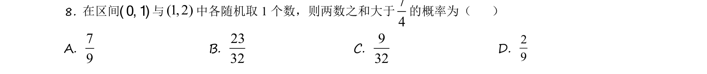
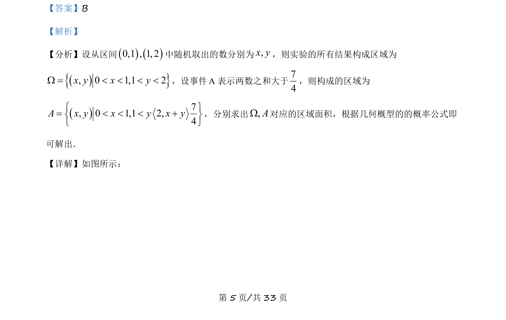
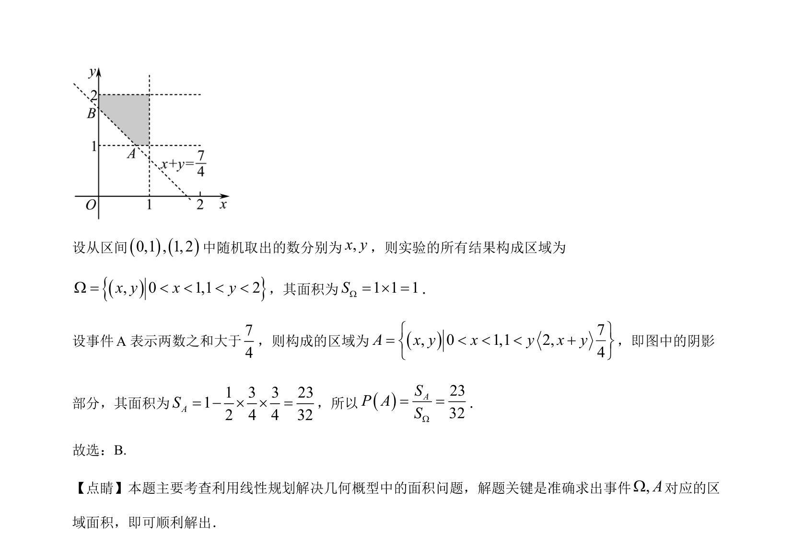

## 题面

## 摘要

本题通过线性规划求几何概型面积计算概率。

## 关联考点

- [[667-几何概型|几何概型]]
- [[1074-简单线性规划|线性规划]]
- [[948-概率计算|概率计算]]

## 答案与解析

> 📄 原 PDF 第 5 页：`素材/真题/吉林/2008-2024·（吉林）数学高考真题/2021年高考数学试卷（理）（全国乙卷）（新课标Ⅰ）（解析卷）.pdf`

<!-- 题干文本-start -->
## 题干文本
8. 在区间( 0, 1 )与(1, 2)中各随机取 1 个数，则两数之和大于74
的概率为（    ）
A. 79
B. 2332
C. 932
D. 29
<!-- 题干文本-end -->

<!-- 解析文本-start -->
## 解析文本
【答案】B
【解析】
【分析】设从区间()()0,1 , 1, 2中随机取出的数分别为,x y，则实验的所有结果构成区域为
(){}, 0 1,1 2x y x yW = < < < <，设事件A表示两数之和大于74
，则构成的区域为
()7, 0 1,1 2,4A x y x y x yì ü= < < < +í ýî þ
，分别求出,AW对应的区域面积，根据几何概型的的概率公式即
可解出．
【详解】如图所示：
<!-- 解析文本-end -->
