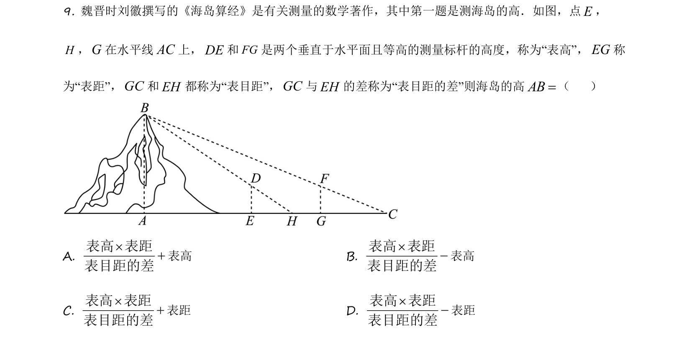
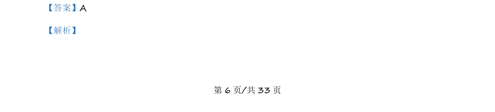
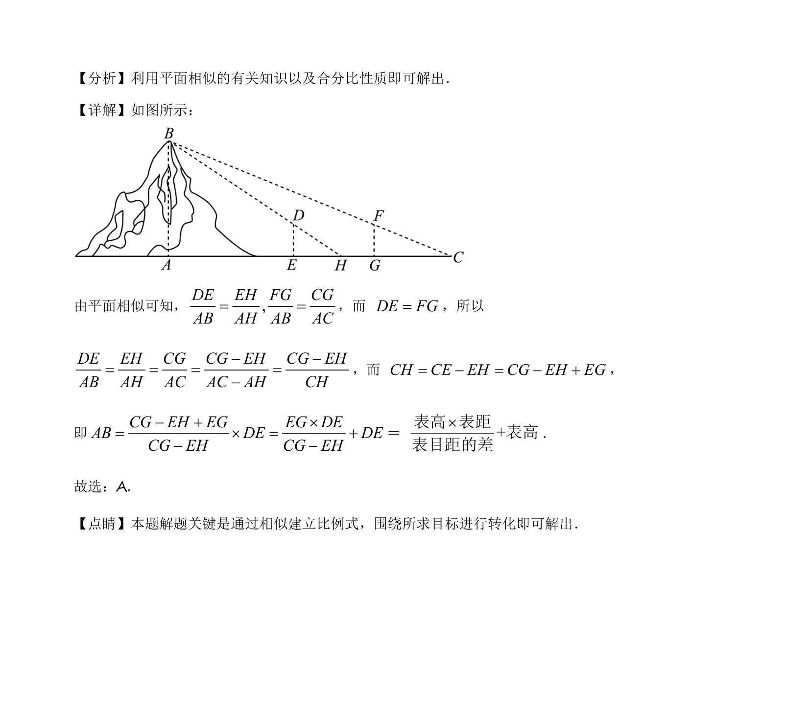

## 题面

## 摘要

据《海岛算经》测海岛高，两个等高测量标杆形成的比例关系，利用相似三角形求海岛高AB的表达式。

## 关联考点

- [[1033-相似三角形|相似三角形]]
- [[568-比例线段|比例线段]]
- [[895-数学史|数学史]]

## 答案与解析

> 📄 原 PDF 第 6 页：`素材/真题/吉林/2008-2024·（吉林）数学高考真题/2021年高考数学试卷（理）（全国乙卷）（新课标Ⅰ）（解析卷）.pdf`

<!-- 题干文本-start -->
## 题干文本
9. 魏晋时刘徽撰写的《海岛算经》是有关测量的数学著作，其中第一题是测海岛的高．如图，点E，
H，G在水平线AC上，DE和FG是两个垂直于水平面且等高的测量标杆的高度，称为“表高”，EG称
为“表距”，GC和EH都称为“表目距”，GC与EH的差称为“表目距的差”则海岛的高AB=（    ）
A. ´+表高表距表目距的差
表高 B. ´-表高表距表目距的差
表高
C. ´+表高表距表目距的差
表距 D. ´-表高表距表目距的差
表距
<!-- 题干文本-end -->

<!-- 解析文本-start -->
## 解析文本
【答案】A
【解析】
<!-- 解析文本-end -->
