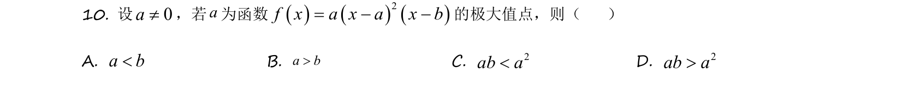
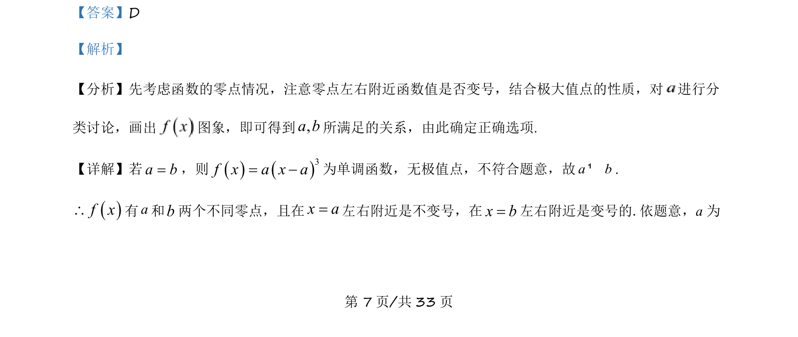
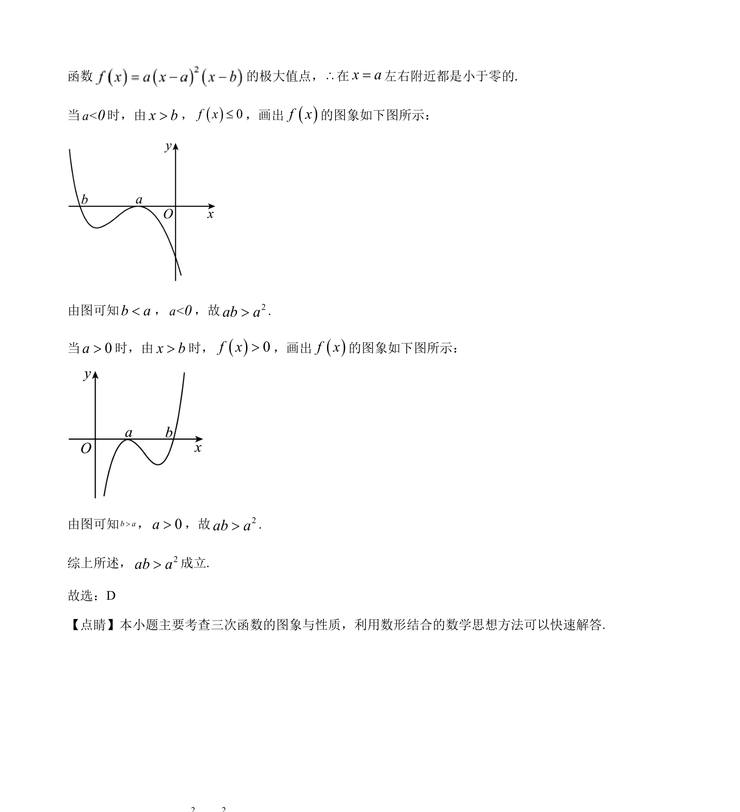

## 题面

## 摘要

三次函数的极值点与参数关系，通过分类讨论和图象分析得到ab>a²

## 关联考点

- [[600-三次函数|三次函数]]
- [[1173-极值点|极值点]]
- [[897-数形结合|数形结合]]
- [[424-参数分类讨论|分类讨论]]

## 答案与解析

> 📄 原 PDF 第 7 页：`素材/真题/吉林/2008-2024·（吉林）数学高考真题/2021年高考数学试卷（理）（全国乙卷）（新课标Ⅰ）（解析卷）.pdf`
