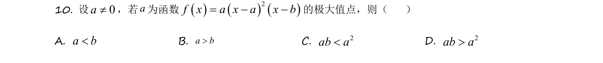
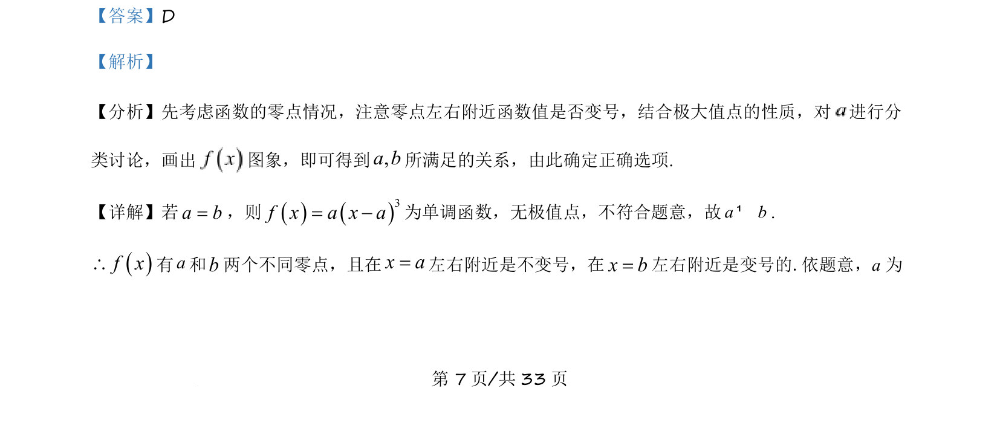
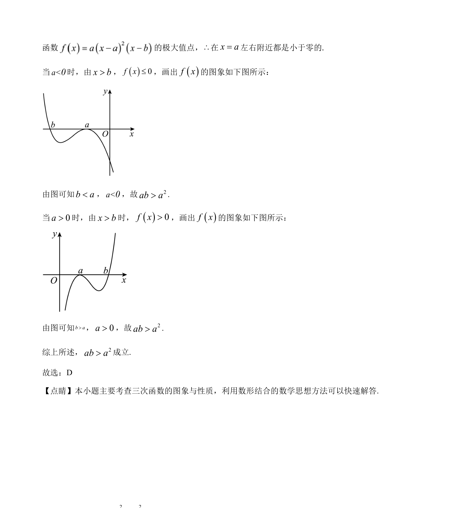

## 题面

## 摘要

三次函数的极值点与参数关系，通过分类讨论和图象分析得到ab>a²

## 关联考点

- [[600-三次函数|三次函数]]
- [[1173-极值点|极值点]]
- [[897-数形结合|数形结合]]
- [[424-参数分类讨论|分类讨论]]

## 答案与解析

> 📄 原 PDF 第 7 页：`素材/真题/吉林/2008-2024·（吉林）数学高考真题/2021年高考数学试卷（理）（全国乙卷）（新课标Ⅰ）（解析卷）.pdf`

<!-- 题干文本-start -->
## 题干文本
10. 设0a¹，若a为函数2f x a x a x b= - -的极大值点，则（    ）
A. a b<B. a b>C. 2ab a<D. 2ab a>
<!-- 题干文本-end -->

<!-- 解析文本-start -->
## 解析文本
【答案】D
【解析】
【分析】先考虑函数的零点情况，注意零点左右附近函数值是否变号，结合极大值点的性质，对 进行分
类讨论，画出 图象，即可得到,a b所满足的关系，由此确定正确选项.
【详解】若a b=，则3f x a x a= -为单调函数，无极值点，不符合题意，故a b¹.
f x\有a和b两个不同零点，且在x a=左右附近是不变号，在x b=左右附近是变号的.依题意，a 为
<!-- 解析文本-end -->
