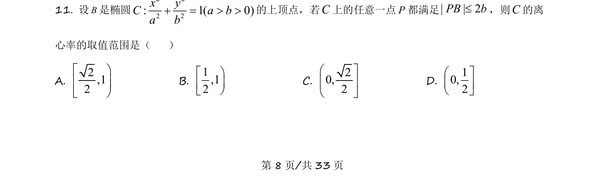

## 题面

## 摘要

已知椭圆上动点及其对称点，求距离最大值，结合二次函数分类讨论构造齐次不等式，解得离心率范围。

## 关联考点

- [[两点间距离公式]]
- [[二次函数最值]]
- [[391-椭圆离心率|椭圆离心率]]
- [[424-参数分类讨论|分类讨论]]

## 答案与解析

> 📄 原 PDF 第 8 页：`素材/真题/吉林/2008-2024·（吉林）数学高考真题/2021年高考数学试卷（理）（全国乙卷）（新课标Ⅰ）（解析卷）.pdf`
