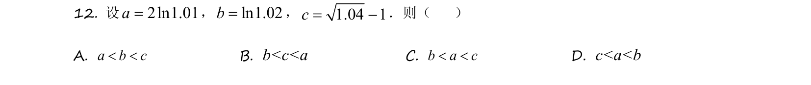
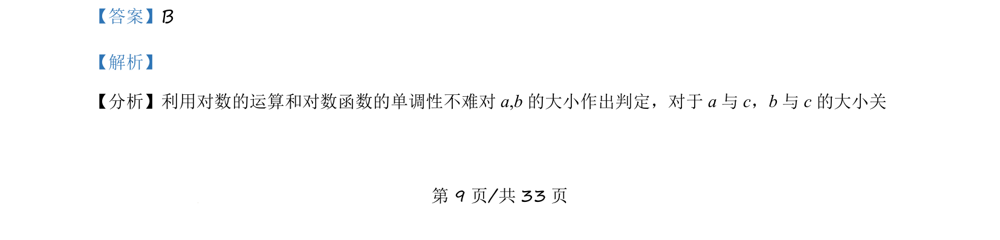

## 题面

## 摘要

本题通过构造函数与导数，结合对数运算与单调性比较三个数的大小。

## 关联考点

- [[对数运算]]
- [[对数函数单调性]]
- [[构造函数]]
- [[436-导数应用-几何最值|导数应用]]

## 答案与解析

> 📄 原 PDF 第 9 页：`素材/真题/吉林/2008-2024·（吉林）数学高考真题/2021年高考数学试卷（理）（全国乙卷）（新课标Ⅰ）（解析卷）.pdf`
