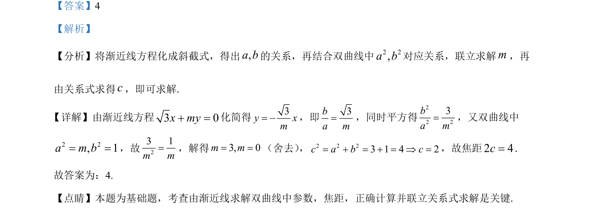

## 题面

## 摘要

由双曲线渐近线方程求参数及焦距

## 关联考点

- [[368-双曲线定义与方程|双曲线]]
- [[369-双曲线渐近线|渐近线]]
- [[037-焦点焦距|焦距]]

## 答案与解析

> 📄 原 PDF 第 11 页：`素材/真题/吉林/2008-2024·（吉林）数学高考真题/2021年高考数学试卷（理）（全国乙卷）（新课标Ⅰ）（解析卷）.pdf`
