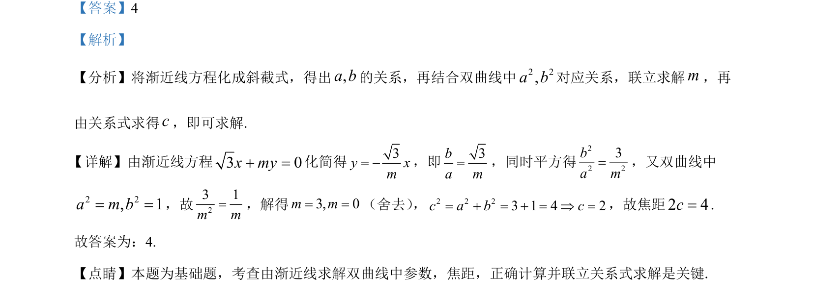

## 题面

## 摘要

由双曲线渐近线方程求参数及焦距

## 关联考点

- [[368-双曲线定义与方程|双曲线]]
- [[369-双曲线渐近线|渐近线]]
- [[037-焦点焦距|焦距]]

## 答案与解析

> 📄 原 PDF 第 11 页：`素材/真题/吉林/2008-2024·（吉林）数学高考真题/2021年高考数学试卷（理）（全国乙卷）（新课标Ⅰ）（解析卷）.pdf`

<!-- 题干文本-start -->
## 题干文本
13. 已知双曲线
22: 1( 0)xC y mm- = >的一条渐近线为3 0x my+ =，则 C的焦距为_________．
<!-- 题干文本-end -->

<!-- 解析文本-start -->
## 解析文本
【答案】4
【解析】
【分析】将渐近线方程化成斜截式，得出,a b的关系，再结合双曲线中2 2,a b对应关系，联立求解m，再
由关系式求得c，即可求解.
详解】由渐近线方程3 0x my+ =化简得3y xm= -，即3ba m=，同时平方得
22 23ba m=，又双曲线中
2 2, 1a m b= =，故23 1m m=，解得3, 0m m= =（舍去） ，2 2 23 1 4 2c a b c= + = + = Þ =，故焦距2 4c=.
故答案为：4.
【点睛】本题为基础题，考查由渐近线求解双曲线中参数，焦距，正确计算并联立关系式求解是关键.
<!-- 解析文本-end -->
