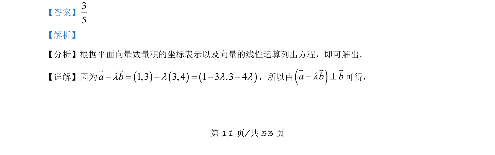
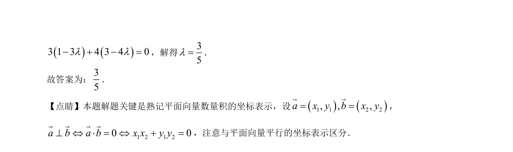

## 题面

## 摘要

考查平面向量垂直的坐标表示，通过数量积为零求参数λ

## 关联考点

- [[855-平面向量数量积的坐标表示|平面向量数量积的坐标表示]]
- [[542-向量垂直|向量垂直]]
- [[543-向量的线性运算|向量的线性运算]]

## 答案与解析

> 📄 原 PDF 第 11 页：`素材/真题/吉林/2008-2024·（吉林）数学高考真题/2021年高考数学试卷（理）（全国乙卷）（新课标Ⅰ）（解析卷）.pdf`

<!-- 题干文本-start -->
## 题干文本
14. 已知向量()()1,3 , 3,4a b= =r r
，若( )a b bl- ^r r r
，则l=__________．
<!-- 题干文本-end -->

<!-- 解析文本-start -->
## 解析文本
【答案】35
【解析】
【分析】根据平面向量数量积的坐标表示以及向量的线性运算列出方程，即可解出．
【详解】因为()()()1,3 3, 4 1 3 ,3 4a bl l l l- = - = - -r r
，所以由()a b bl- ^r r r
可得，
【
<!-- 解析文本-end -->
