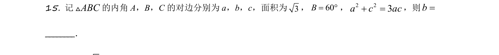
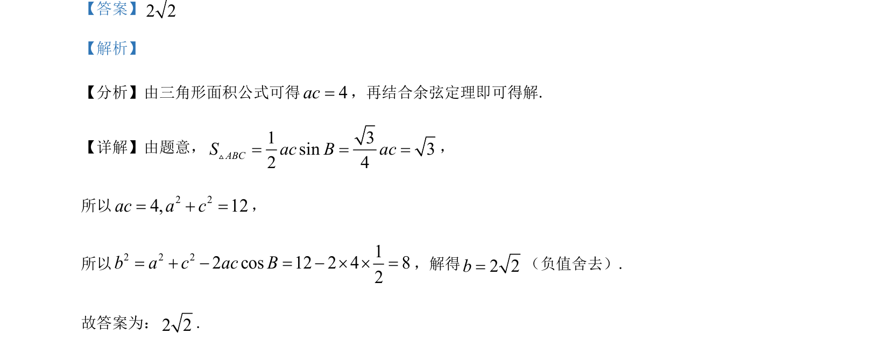

## 题面

## 摘要

本题考查解三角形中面积公式与余弦定理的应用，以及三视图的选择与还原。

## 关联考点

- [[解三角形]]
- [[126-定理|余弦定理]]
- [[235-三视图|三视图]]

## 答案与解析

> 📄 原 PDF 第 12 页：`素材/真题/吉林/2008-2024·（吉林）数学高考真题/2021年高考数学试卷（理）（全国乙卷）（新课标Ⅰ）（解析卷）.pdf`
