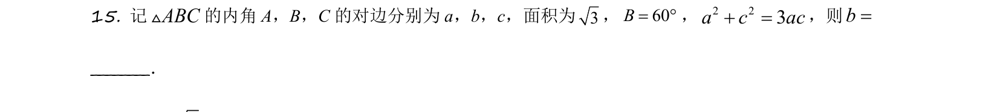
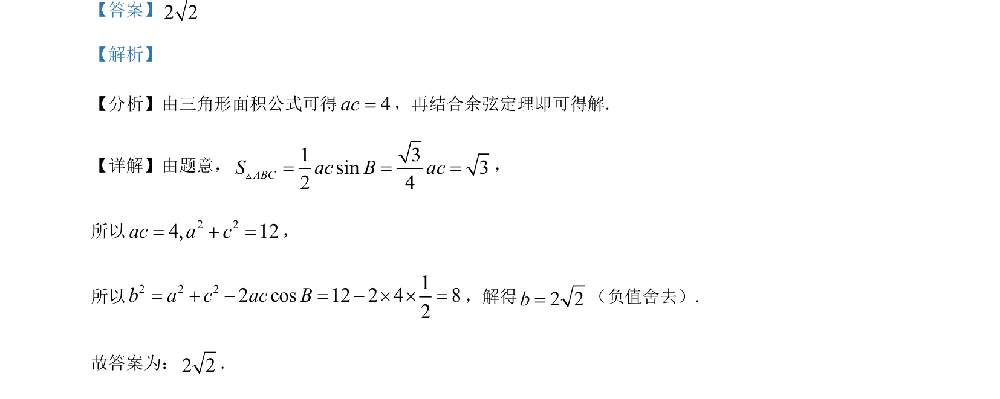

## 题面

## 摘要

△ABC中面积为√3，B=60°，a²+c²=3ac，综合余弦定理与正弦定理求边长b。

## 关联考点

- [[126-定理|余弦定理]]
- [[589-解三角形|解三角形]]
- [[126-定理|正弦定理]]

## 答案与解析

> 📄 原 PDF 第 12 页：`素材/真题/吉林/2008-2024·（吉林）数学高考真题/2021年高考数学试卷（理）（全国乙卷）（新课标Ⅰ）（解析卷）.pdf`

<!-- 题干文本-start -->
## 题干文本
15. 记ABCV的内角 A，B，C的对边分别为 a，b，c，面积为3，60B= °，2 23a c ac+ =，则b=
________．
<!-- 题干文本-end -->

<!-- 解析文本-start -->
## 解析文本
【答案】2 2
【解析】
【分析】由三角形面积公式可得4ac=，再结合余弦定理即可得解.
【详解】由题意，13sin324ABCSacBac===V ，
所以 2 24, 12ac a c= + =，
所以2 2 212 cos 12 2 4 82b a c ac B= + - = - ´ ´ =，解得2 2b=（负值舍去）.
故答案为：2 2.
<!-- 解析文本-end -->
