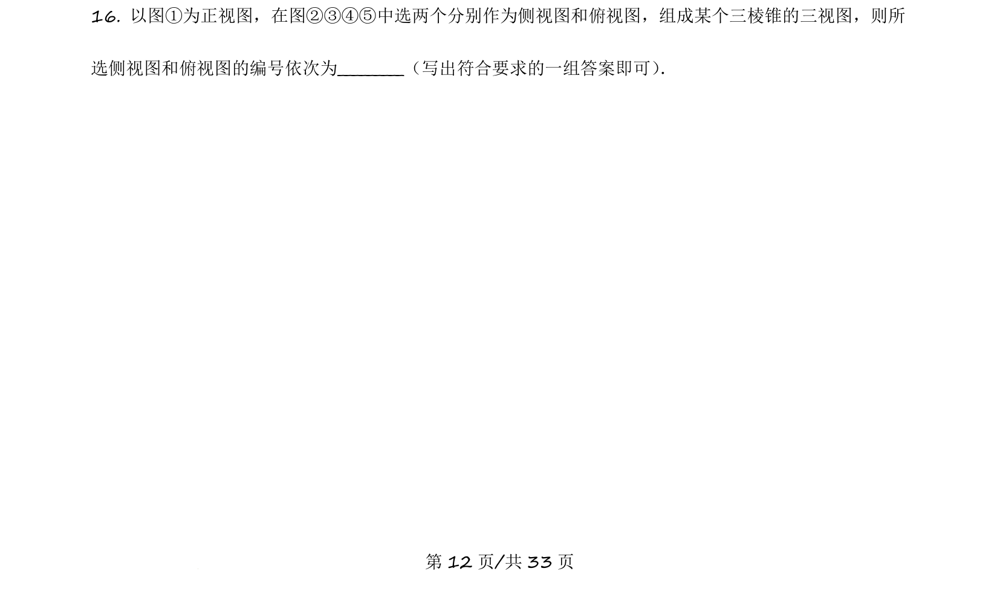
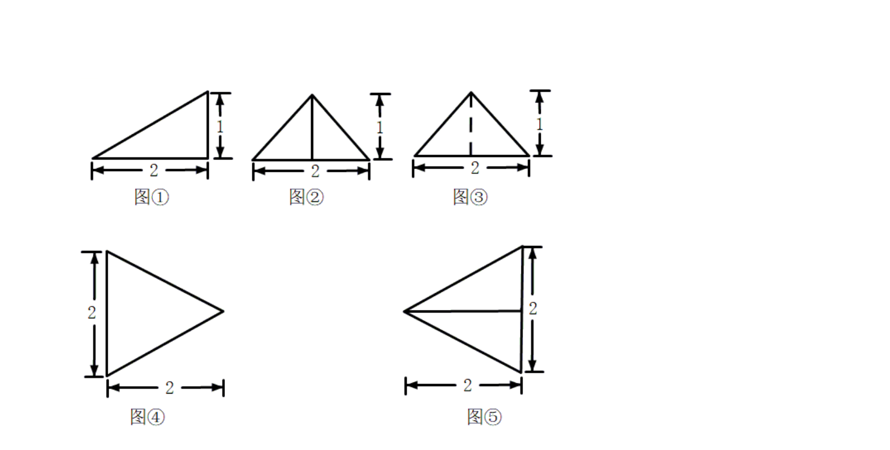
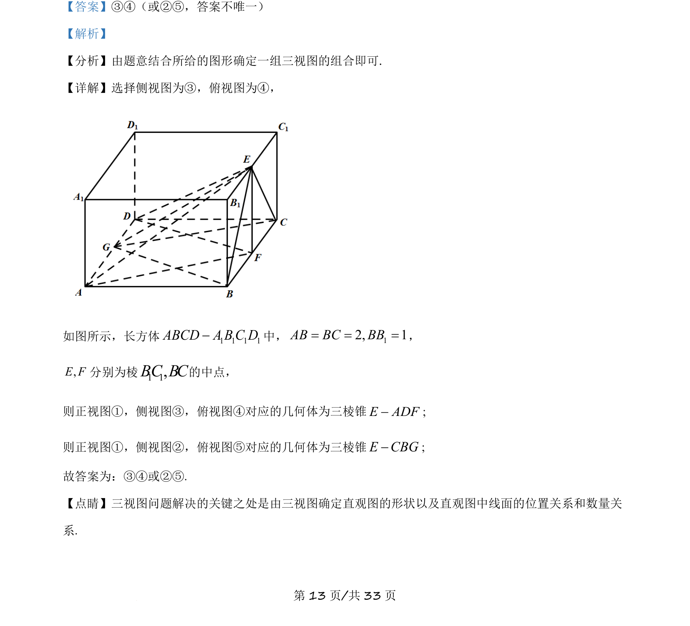
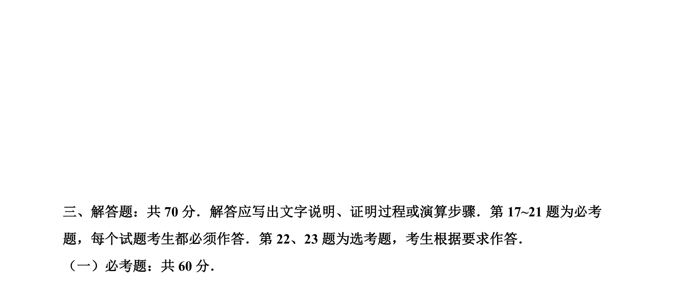

## 题面

## 摘要

给出三棱锥的正视图，选择匹配的侧视图和俯视图编号。

## 关联考点

- [[235-三视图|三视图]]
- [[599-三棱锥|三棱锥]]
- [[1053-空间想象|空间想象]]

## 答案与解析

> 📄 原 PDF 第 12 页：`素材/真题/吉林/2008-2024·（吉林）数学高考真题/2021年高考数学试卷（理）（全国乙卷）（新课标Ⅰ）（解析卷）.pdf`
