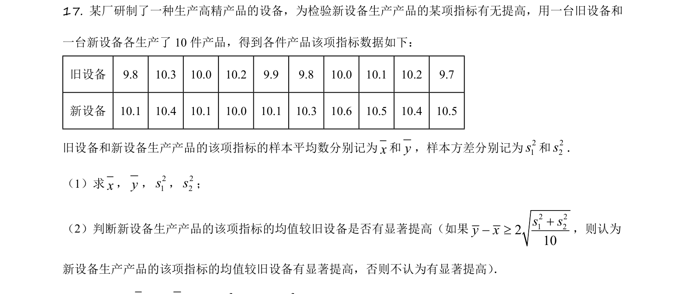
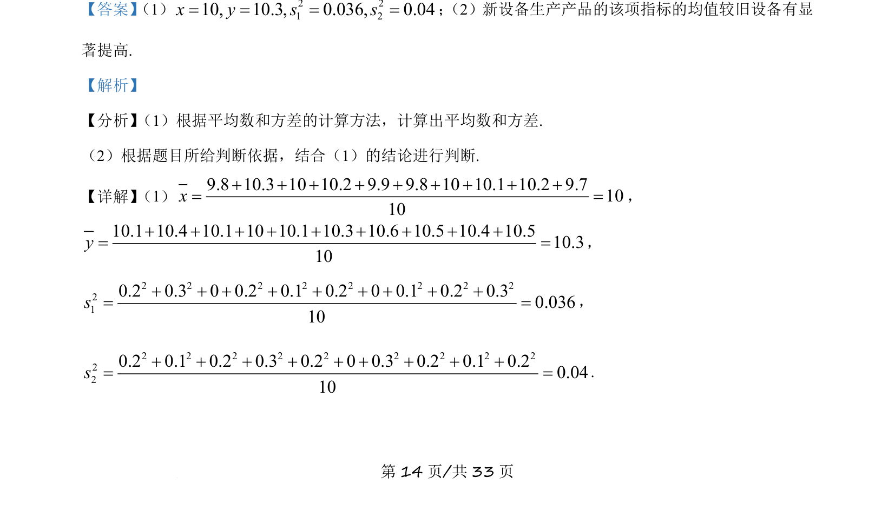
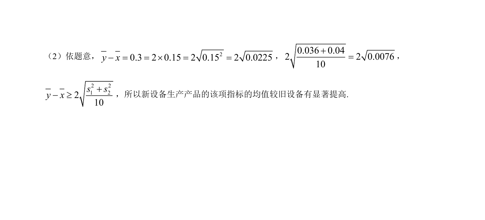

## 题面

## 摘要

本题给出新旧设备各10件产品的指标数据，要求计算样本平均数、方差，并依据给定标准判断新设备均值是否有显著提高。

## 关联考点

- [[843-平均数计算|平均数计算]]
- [[905-方差计算|方差计算]]
- [[908-显著性检验|显著性检验]]

## 答案与解析

> 📄 原 PDF 第 14 页：`素材/真题/吉林/2008-2024·（吉林）数学高考真题/2021年高考数学试卷（理）（全国乙卷）（新课标Ⅰ）（解析卷）.pdf`
