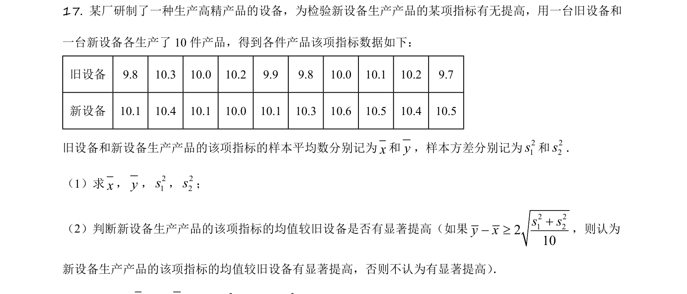
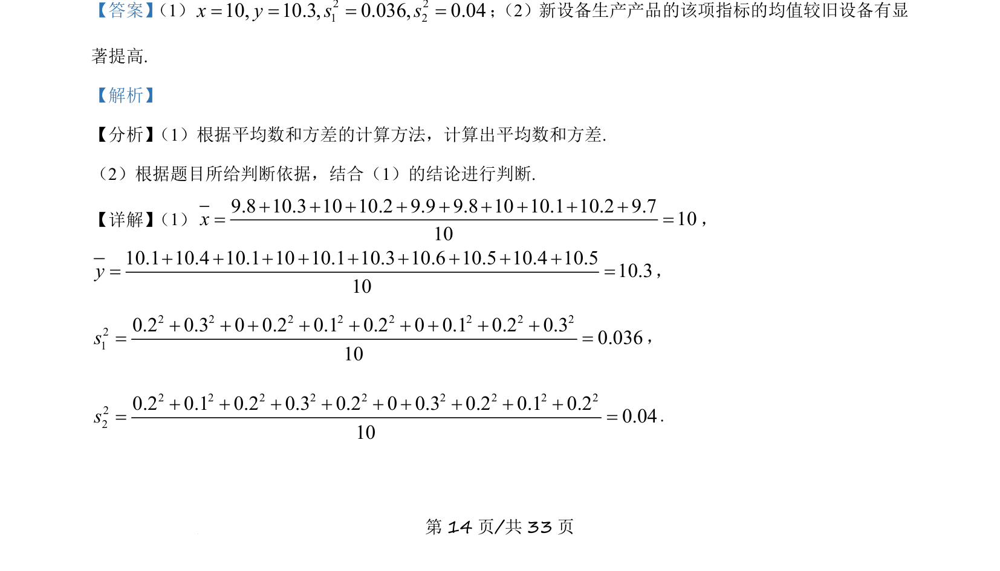
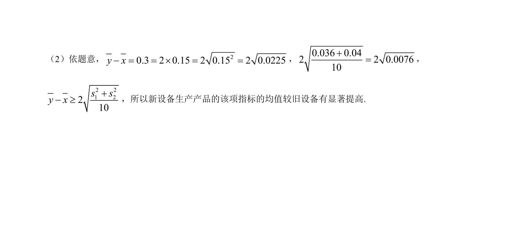

## 题面

## 摘要

本题给出新旧设备各10件产品的指标数据，要求计算样本平均数、方差，并依据给定标准判断新设备均值是否有显著提高。

## 关联考点

- [[843-平均数计算|平均数计算]]
- [[905-方差计算|方差计算]]
- [[908-显著性检验|显著性检验]]

## 答案与解析

> 📄 原 PDF 第 14 页：`素材/真题/吉林/2008-2024·（吉林）数学高考真题/2021年高考数学试卷（理）（全国乙卷）（新课标Ⅰ）（解析卷）.pdf`

<!-- 题干文本-start -->
## 题干文本
17. 某厂研制了一种生产高精产品的设备，为检验新设备生产产品的某项指标有无提高，用一台旧设备和
一台新设备各生产了 10 件产品，得到各件产品该项指标数据如下：
旧设备 9.8 10.3 10.0 10.2 9.9 9.8 10.0 10.1 10.2 9.7
新设备 10.1 10.4 10.1 10.0 10.1 10.3 10.6 10.5 10.4 10.5
旧设备和新设备生产产品的该项指标的样本平均数分别记为x和y，样本方差分别记为21s和22s．
（1）求x，y，21s，22s；
（2）判断新设备生产产品的该项指标的均值较旧设备是否有显著提高（如果
2 21 2210s sy x+- ³，则认为
新设备生产产品的该项指标的均值较旧设备有显著提高，否则不认为有显著提高） ．
<!-- 题干文本-end -->

<!-- 解析文本-start -->
## 解析文本
【答案】 （1） 2 21 210, 10.3, 0.036, 0.04x y s s= = = =； （2）新设备生产产品的该项指标的均值较旧设备有显
著提高.
【解析】
【分析】 （1）根据平均数和方差的计算方法，计算出平均数和方差.
（2）根据题目所给判断依据，结合（1）的结论进行判断.
【详解】 （1）9.8 10.3 10 10.2 9.9 9.8 10 10.1 10.2 9.71010x+ + + + + + + + += =，
10.1 10.4 10.1 10 10.1 10.3 10.6 10.5 10.4 10.510.310y+ + + + + + + + += =，
2 2 2 2 2 2 2 2210.2 0.3 0 0.2 0.1 0.2 0 0.1 0.2 0.30.03610s+ + + + + + + + += =，
2 2 2 2 2 2 2 2 2220.2 0.1 0.2 0.3 0.2 0 0.3 0.2 0.1 0.20.0410s+ + + + + + + + += =.
<!-- 解析文本-end -->
