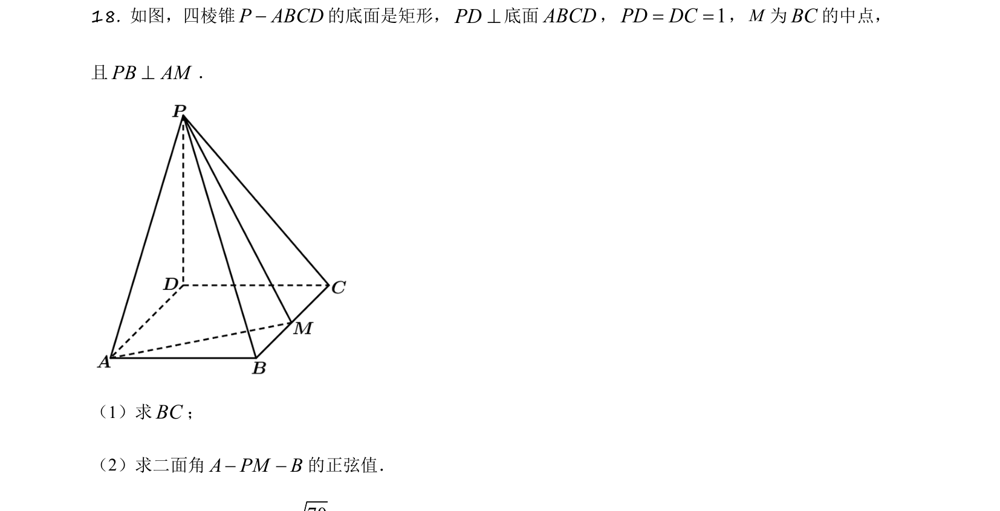
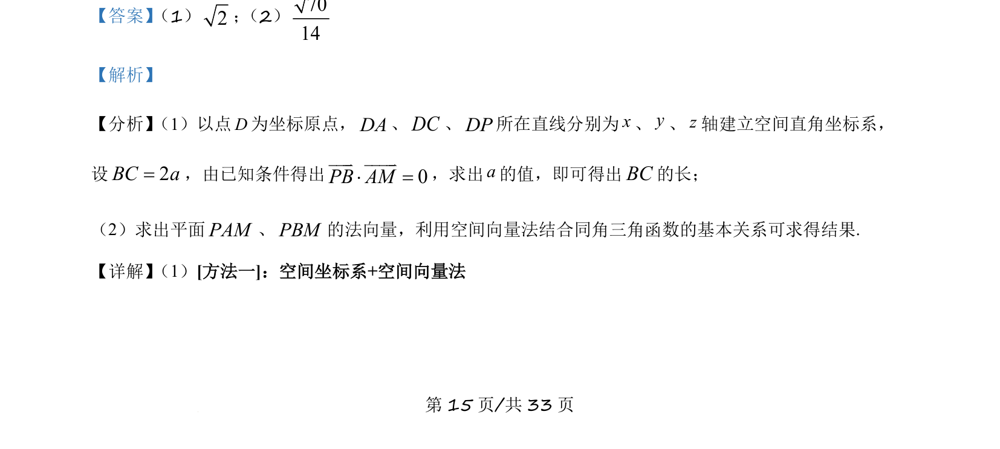
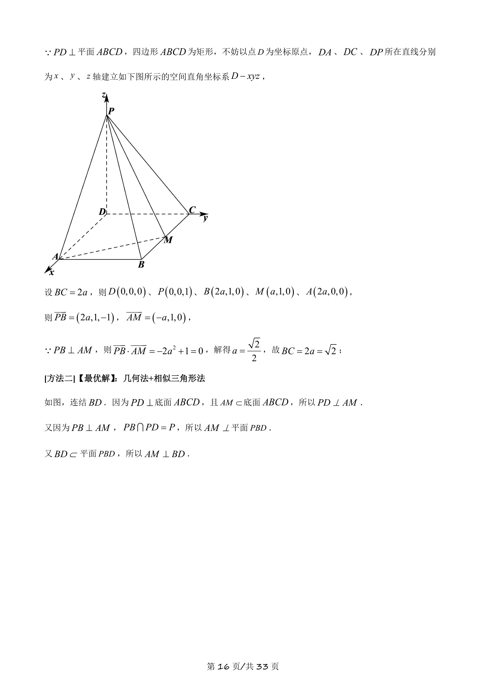
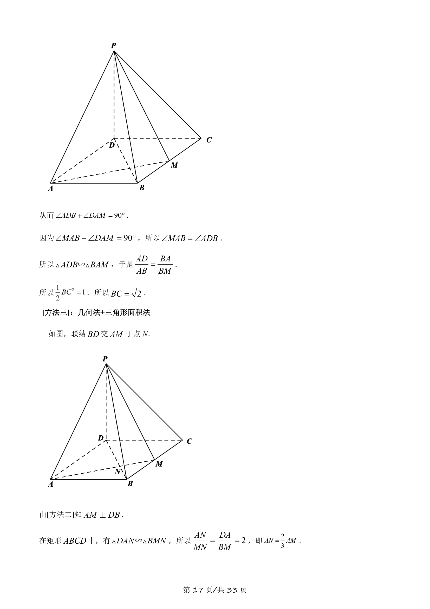
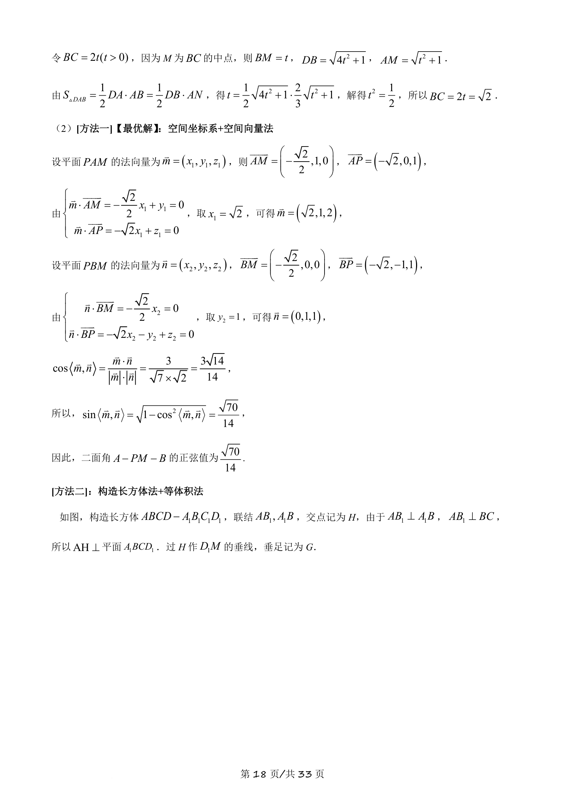
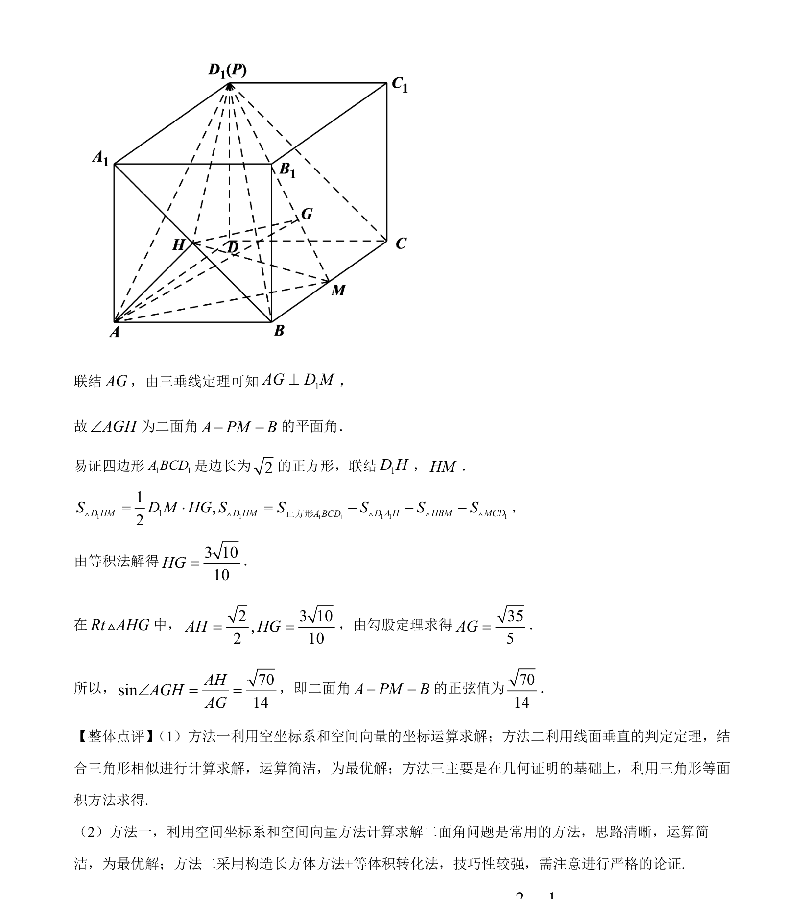

## 题面

## 摘要

四棱锥中建立空间直角坐标系，利用向量数量积求边长，用法向量求二面角正弦值。

## 关联考点

- [[399-空间向量坐标表示|空间直角坐标系]]
- [[751-向量数量积|向量数量积]]
- [[411-空间平面法向量|法向量]]
- [[353-空间角|二面角]]

## 答案与解析

> 📄 原 PDF 第 15 页：`素材/真题/吉林/2008-2024·（吉林）数学高考真题/2021年高考数学试卷（理）（全国乙卷）（新课标Ⅰ）（解析卷）.pdf`
