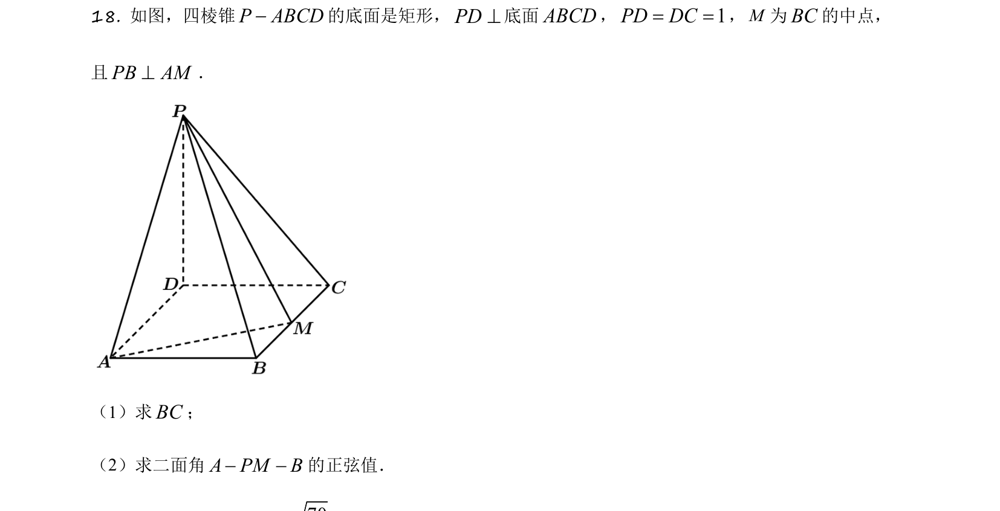
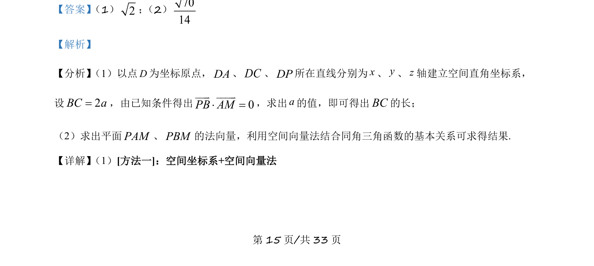
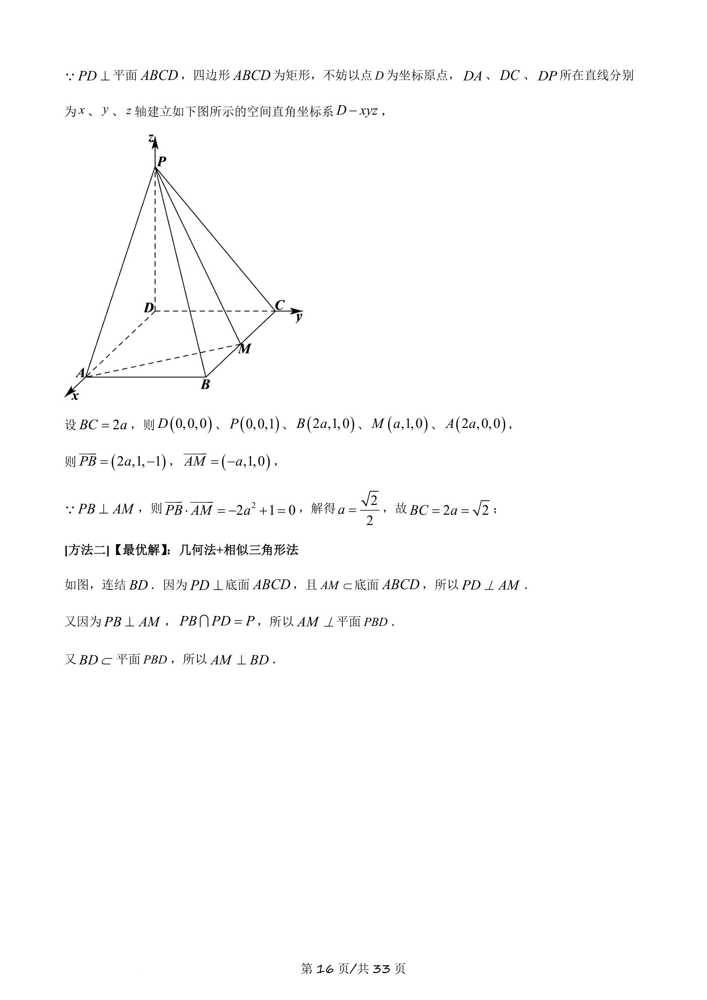
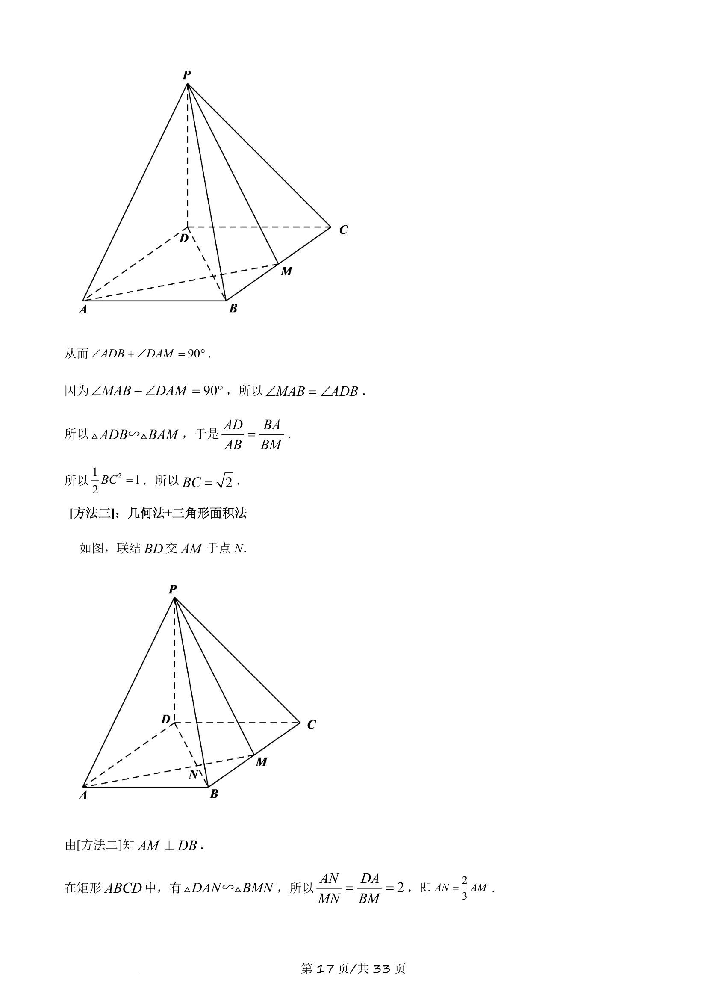
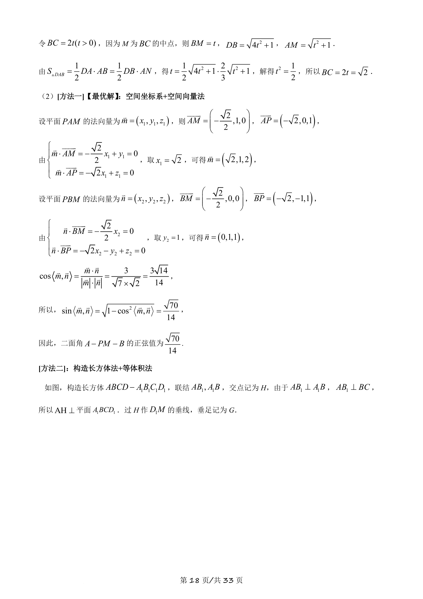
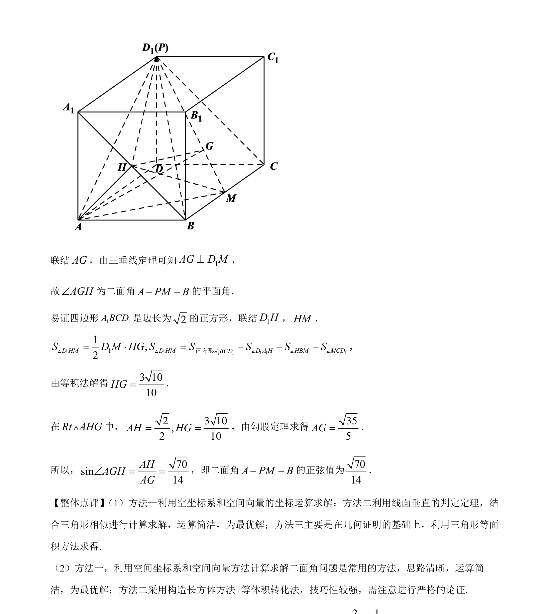

## 题面

## 摘要

四棱锥中建立空间直角坐标系，利用向量数量积求边长，用法向量求二面角正弦值。

## 关联考点

- [[399-空间向量坐标表示|空间直角坐标系]]
- [[328-向量的数量积|向量数量积]]
- [[411-空间平面法向量|法向量]]
- [[353-空间角|二面角]]

## 答案与解析

> 📄 原 PDF 第 15 页：`素材/真题/吉林/2008-2024·（吉林）数学高考真题/2021年高考数学试卷（理）（全国乙卷）（新课标Ⅰ）（解析卷）.pdf`

<!-- 题干文本-start -->
## 题干文本
18. 如图，四棱锥P ABCD-的底面是矩形，PD^底面ABCD， 1PD DC= =，M为BC的中点，
且PB AM^．
（1）求BC；
（2）求二面角A PM B- -的正弦值．
<!-- 题干文本-end -->

<!-- 解析文本-start -->
## 解析文本
【答案】 （1）2； （2）7014
【解析】
【分析】 （1）以点D为坐标原点，DA、DC、DP所在直线分别为x、y、z轴建立空间直角坐标系，
设2BC a=，由已知条件得出 0PB AM× =uuu v uuuu v
，求出a的值，即可得出BC的长；
（2）求出平面PAM、PBM的法向量，利用空间向量法结合同角三角函数的基本关系可求得结果.
【详解】 （1）[方法一]：空间坐标系+空间向量法
<!-- 解析文本-end -->
