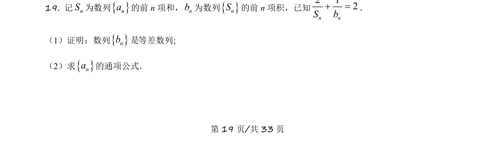
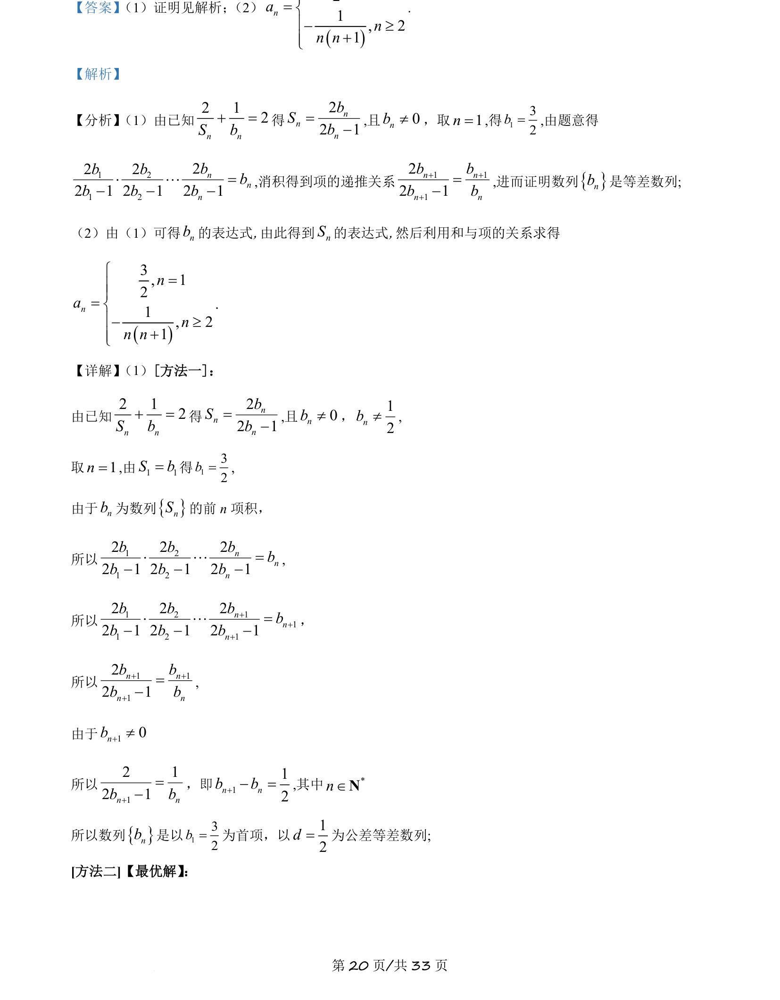
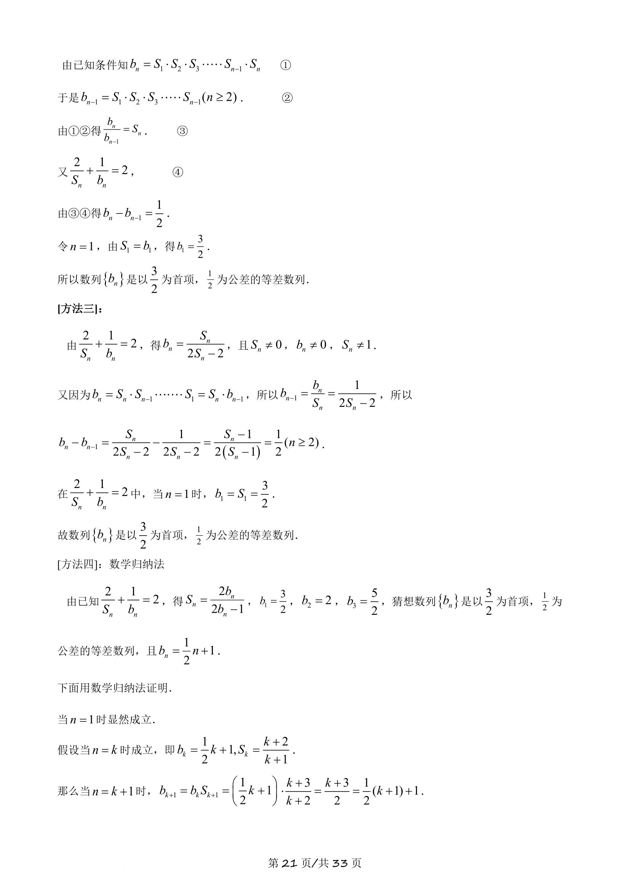
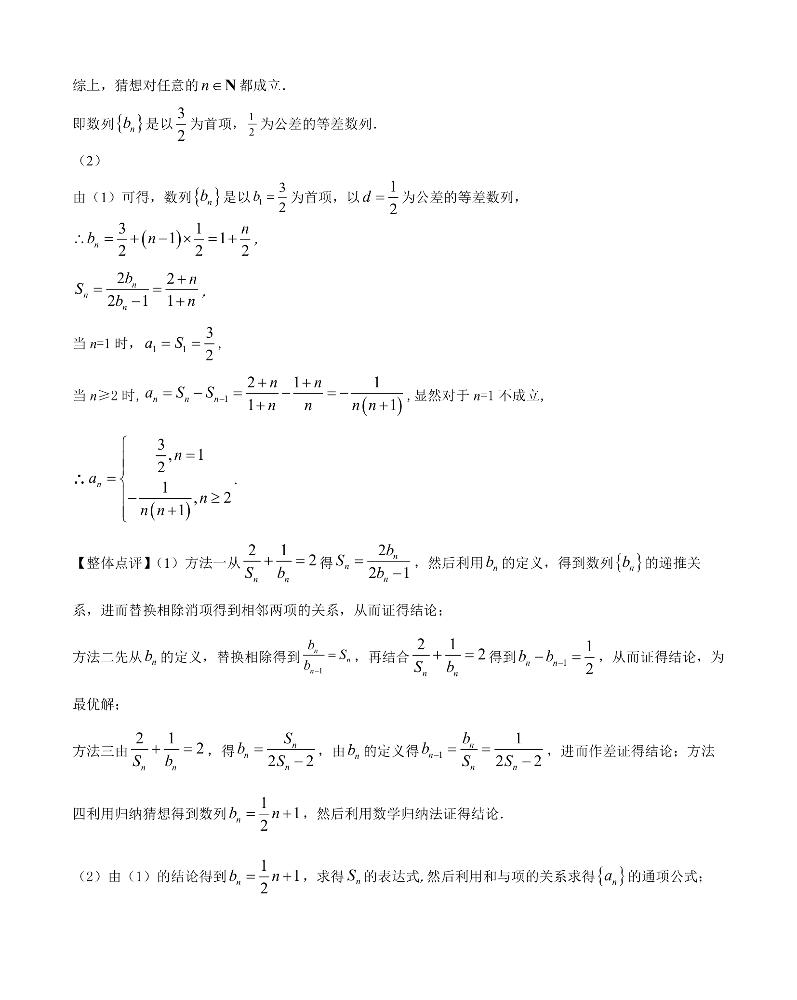

## 题面

## 摘要

本题主要考查数列前n项和与前n项积的关系，通过已知等式证明等差数列并求通项公式。

## 关联考点

- [[356-等差数列概念|等差数列]]
- [[384-数列通项公式|数列通项公式]]
- [[712-前n项和与积|前n项和与积]]

## 答案与解析

> 📄 原 PDF 第 19 页：`素材/真题/吉林/2008-2024·（吉林）数学高考真题/2021年高考数学试卷（理）（全国乙卷）（新课标Ⅰ）（解析卷）.pdf`
