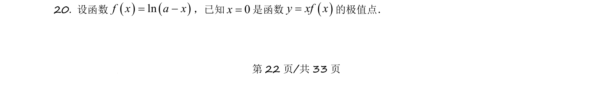

## 题面

## 摘要

已知x=0是y=xln(a-x)的极值点，求参数值并分析极值性质。

## 关联考点

- [[极值点判定]]
- [[复合函数求导]]
- [[参数求解]]
- [[隐零点分析]]

## 答案与解析

> 📄 原 PDF 第 22 页：`素材/真题/吉林/2008-2024·（吉林）数学高考真题/2021年高考数学试卷（理）（全国乙卷）（新课标Ⅰ）（解析卷）.pdf`
