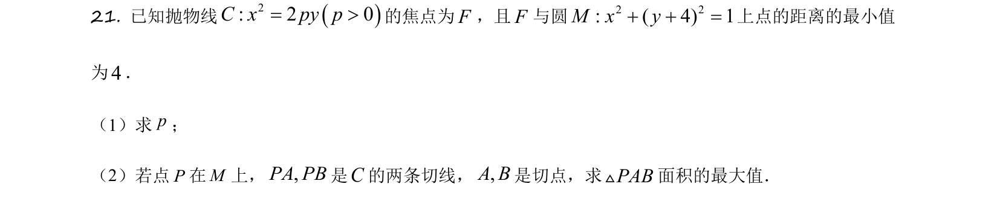
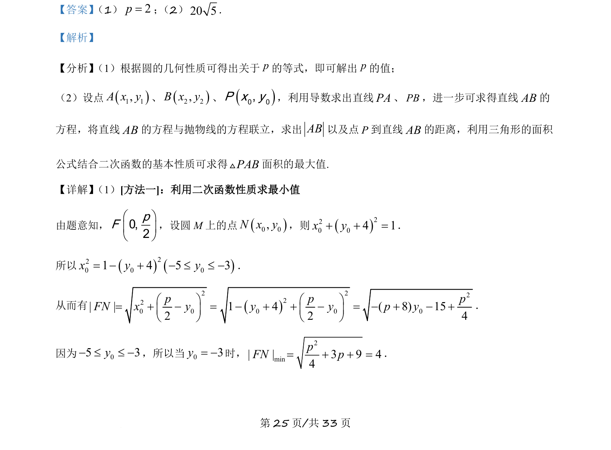
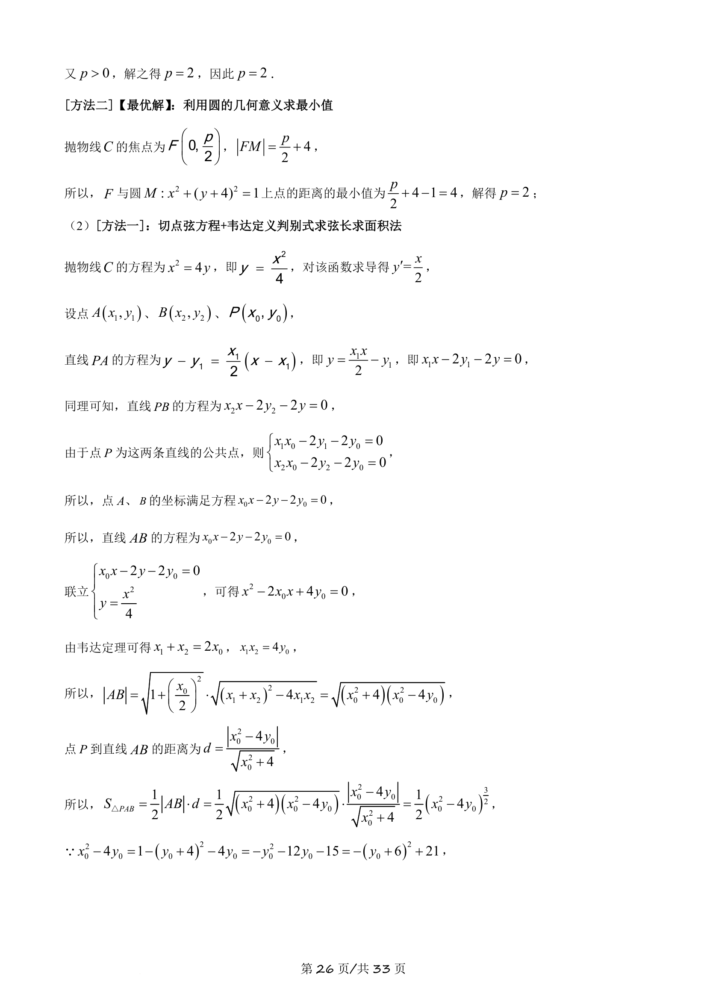
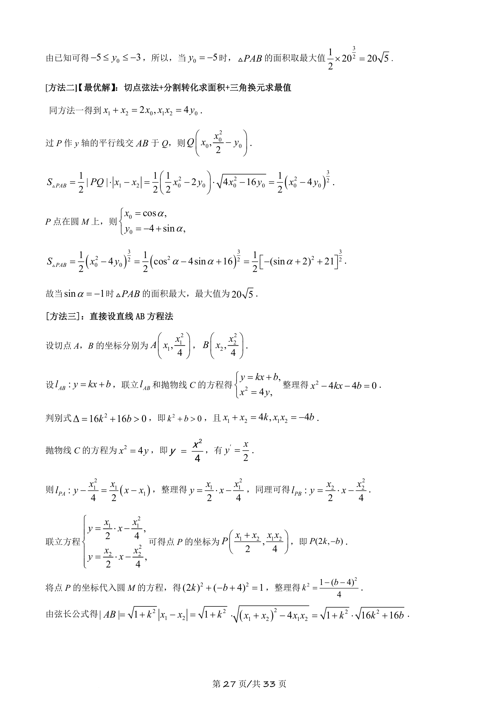
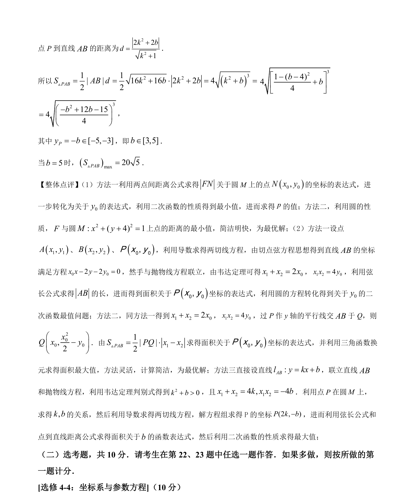

## 题面

## 摘要

本题通过抛物线与圆的位置关系求参数，并计算切线构成的三角形面积的最大值。

## 关联考点

- [[227-抛物线|抛物线]]
- [[圆的方程]]
- [[217-切线|切线]]
- [[二次函数最值]]

## 答案与解析

> 📄 原 PDF 第 25 页：`素材/真题/吉林/2008-2024·（吉林）数学高考真题/2021年高考数学试卷（理）（全国乙卷）（新课标Ⅰ）（解析卷）.pdf`
