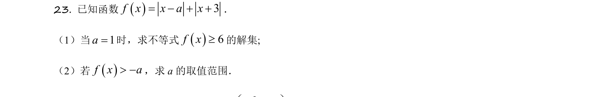
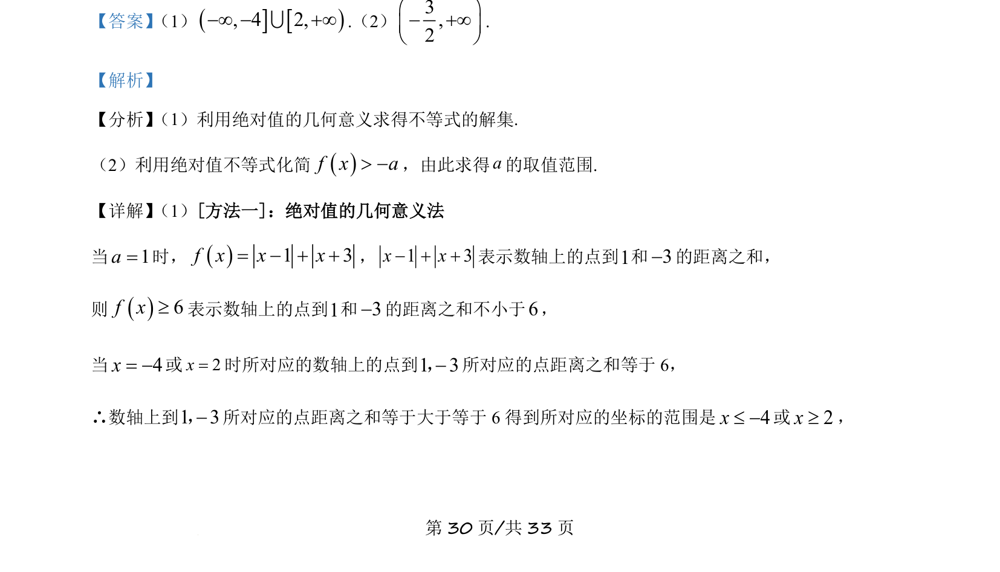
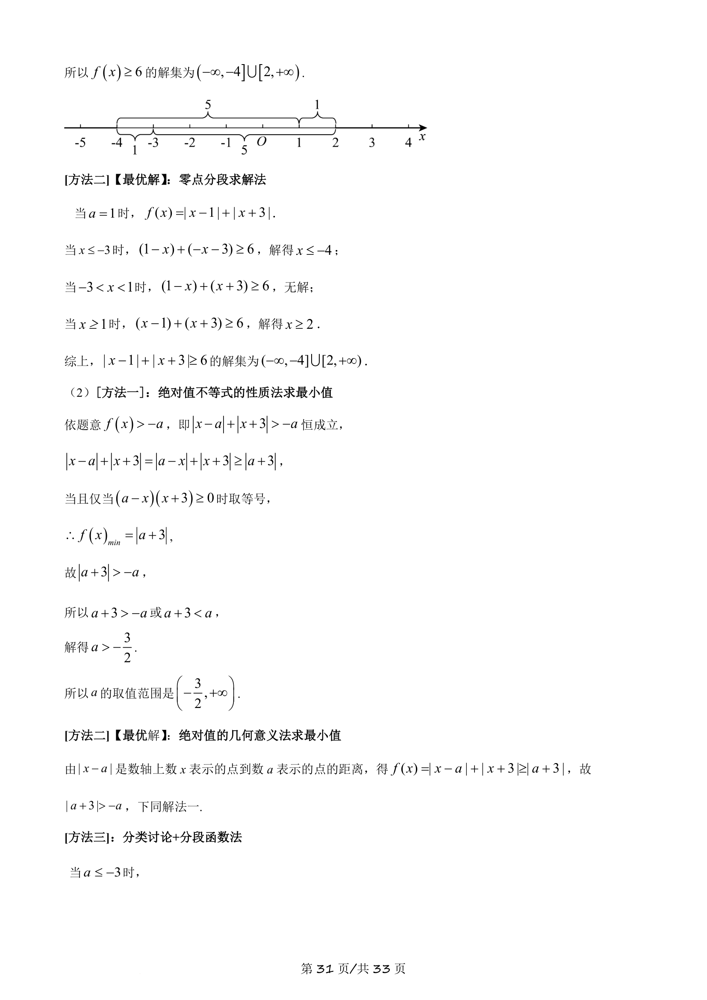
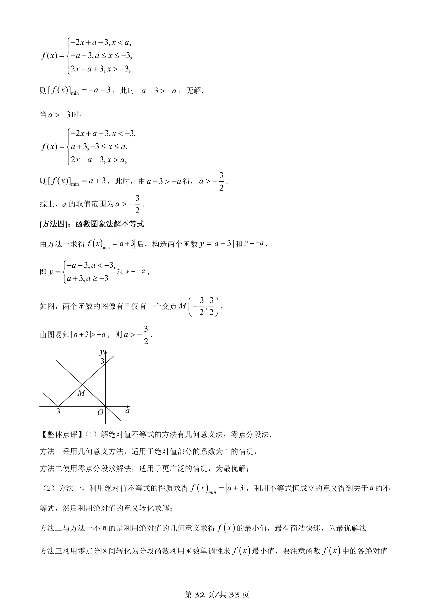
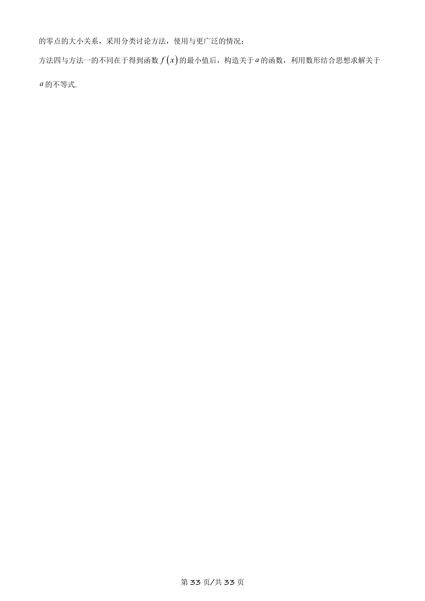

## 题面

## 摘要

本题主要考查含绝对值函数的不等式求解，包括利用绝对值的几何意义解绝对值不等式，以及根据不等式恒成立求参数取值范围。

## 关联考点

- [[1093-绝对值不等式|绝对值不等式]]
- [[721-参数取值范围|参数取值范围]]
- [[898-数形结合|数形结合]]

## 答案与解析

> 📄 原 PDF 第 30 页：`素材/真题/吉林/2008-2024·（吉林）数学高考真题/2021年高考数学试卷（理）（全国乙卷）（新课标Ⅰ）（解析卷）.pdf`
