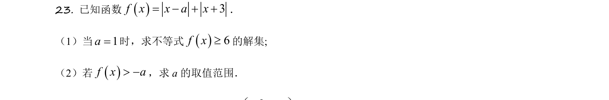
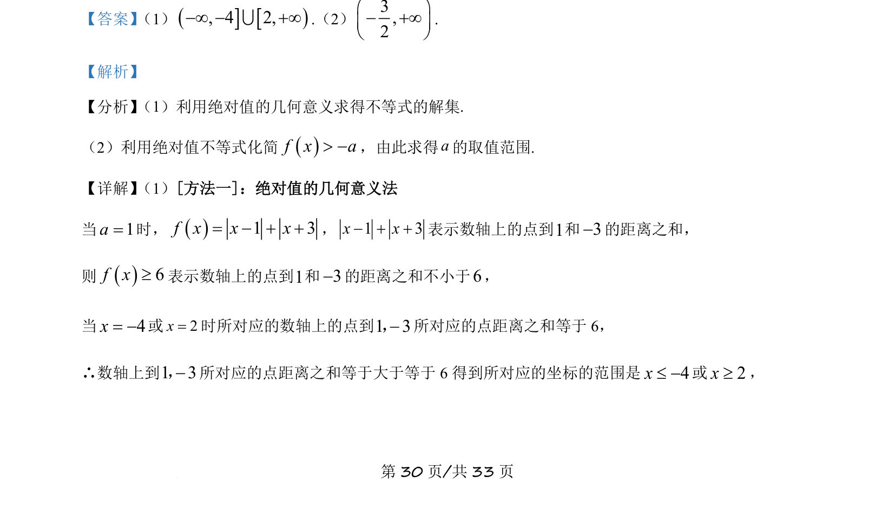
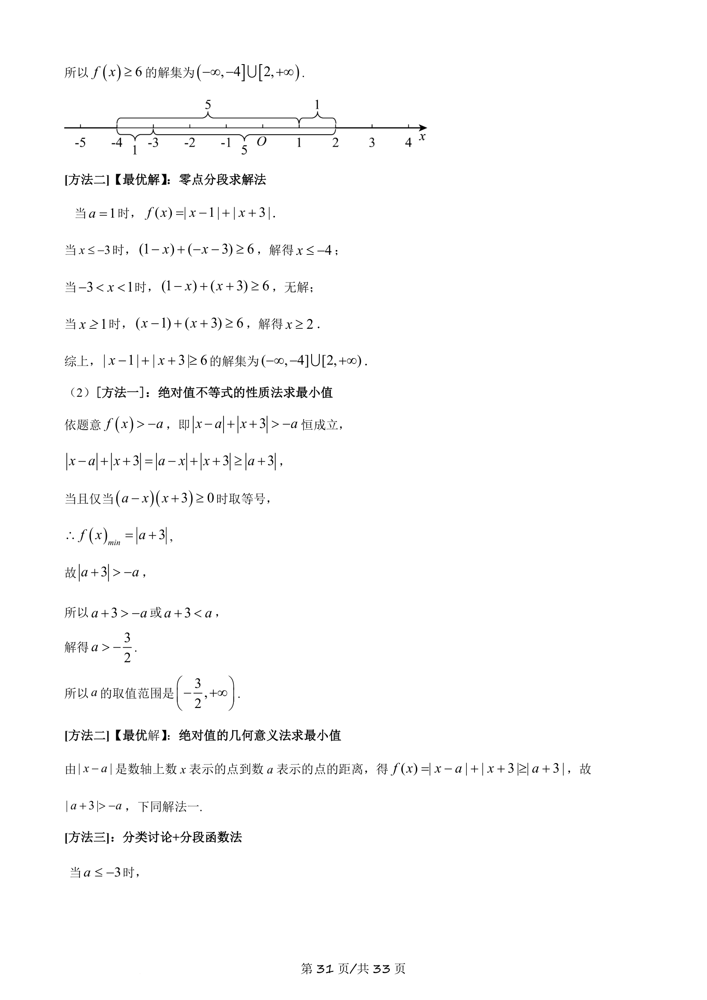
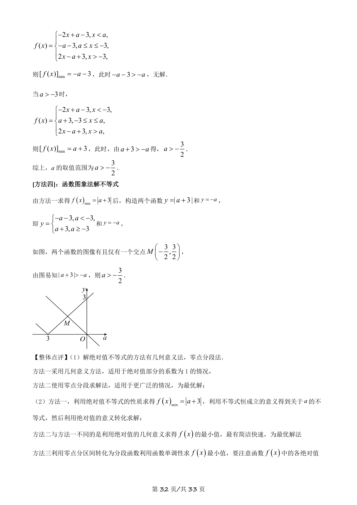
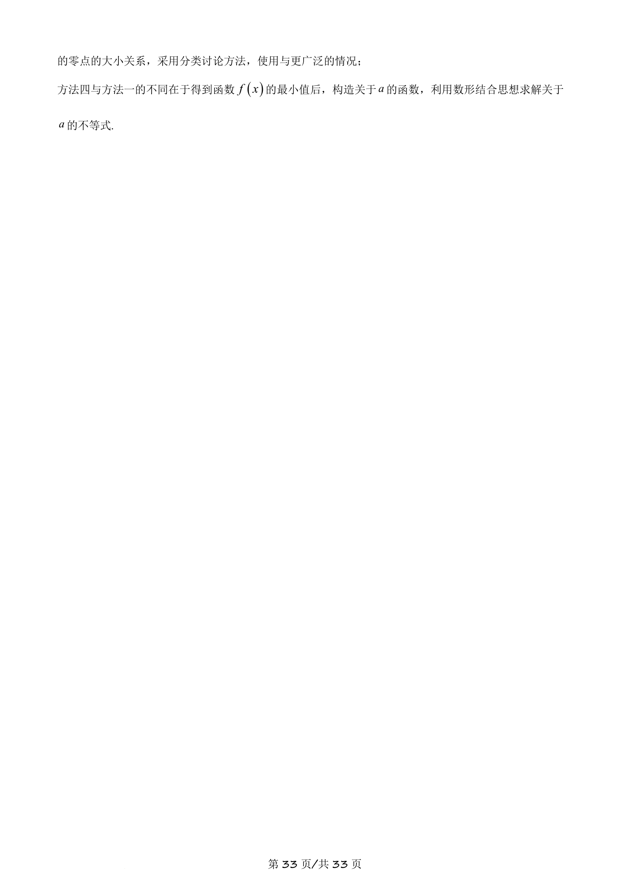

## 题面

## 摘要

本题主要考查含绝对值函数的不等式求解，包括利用绝对值的几何意义解绝对值不等式，以及根据不等式恒成立求参数取值范围。

## 关联考点

- [[1092-绝对值不等式|绝对值不等式]]
- [[721-参数取值范围|参数取值范围]]
- [[897-数形结合|数形结合]]

## 答案与解析

> 📄 原 PDF 第 30 页：`素材/真题/吉林/2008-2024·（吉林）数学高考真题/2021年高考数学试卷（理）（全国乙卷）（新课标Ⅰ）（解析卷）.pdf`

<!-- 题干文本-start -->
## 题干文本
23. 已知函数3f x x a x= - + +．
（1）当1a=时，求不等式6f x³的解集;
（2）若f x a> -，求 a 的取值范围．
<!-- 题干文本-end -->

<!-- 解析文本-start -->
## 解析文本
【答案】 （1）, 4 2,-¥ - +¥U.（2）3,2æ ö- +¥ç ÷è ø
.
【解析】
【分析】 （1）利用绝对值的几何意义求得不等式的解集.
（2）利用绝对值不等式化简f x a> -，由此求得a的取值范围.
【详解】 （1）[方法一]：绝对值的几何意义法
当1a=时，1 3f x x x= - + +，1 3x x- + +表示数轴上的点到1和3-的距离之和，
则6f x³表示数轴上的点到1和3-的距离之和不小于6，
当4x= -或2x=时所对应的数轴上的点到1 3-，所对应的点距离之和等于 6，
∴数轴上到1 3-，所对应的点距离之和等于大于等于 6 得到所对应的坐标的范围是4x£ -或2x³，
<!-- 解析文本-end -->
