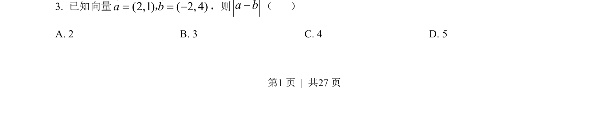
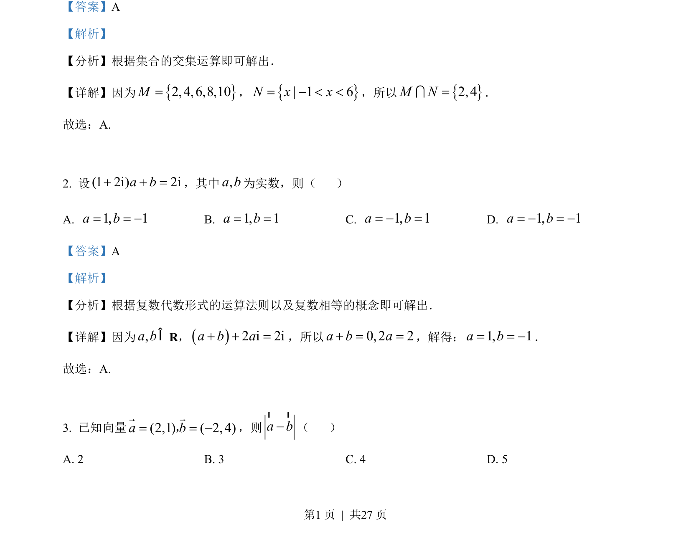

## 题面

## 摘要

本题考查平面向量的坐标减法运算及模长计算。

## 关联考点

- [[322-向量的减法|向量减法]]
- [[752-向量模长|向量模长]]

## 答案与解析

> 📄 原 PDF 第 1 页：`素材/真题/吉林/2008-2024·（吉林）数学高考真题/2022年高考数学试卷（文）（全国乙卷）（解析卷）.pdf`

<!-- 题干文本-start -->
## 题干文本
3．考试结束后，将本试卷和答题卡一并交回.
一、选择题：本题共12小题，每小题5分，共60分.在每小题给出的四个选项中，只有一项
是符合题目要求的.
1. 集合2, 4,6,8,10 , 1 6M N x x= = - < <，则M N=I（    ）
A. {2, 4}B. {2,4,6}C. {2, 4,6,8}D. {2,4,6,8,10}
<!-- 题干文本-end -->

<!-- 解析文本-start -->
## 解析文本
【答案】A
【解析】
【分析】根据集合的交集运算即可解出．
【详解】因为2, 4,6,8,10M=，| 1 6N x x= - < <，所以2, 4M N=I．
故选：A.
2. 设(1 2i) 2ia b+ + =，其中,a b为实数，则（    ）
A. 1, 1a b= = -B. 1, 1a b= =C. 1, 1a b= - =D. 1, 1a b= - = -
【答案】A
【解析】
【分析】根据复数代数形式的运算法则以及复数相等的概念即可解出．
【详解】因为,a bÎR，2 i 2ia b a+ + =，所以0, 2 2a b a+ = =，解得：1, 1a b= = -．
故选：A.
3. 已知向量(2,1) ( 2, 4)a b= = -r r，，则a b-r r
（    ）
A. 2 B. 3 C. 4 D. 5
<!-- 解析文本-end -->
