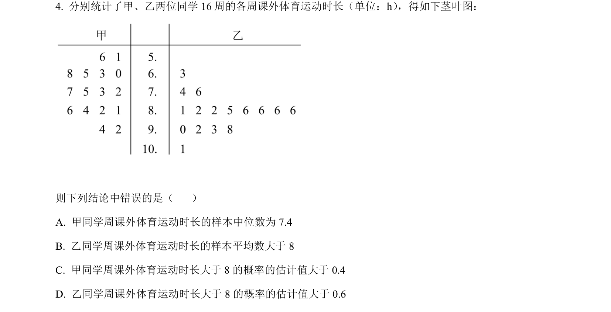
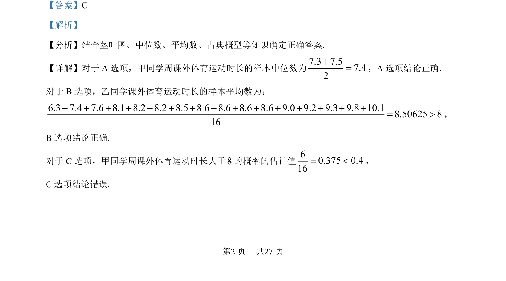
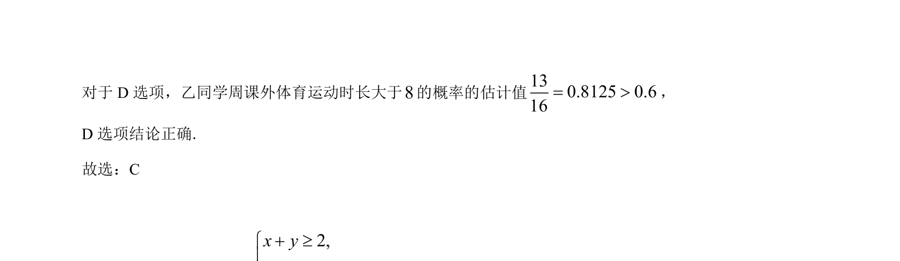

## 题面

## 摘要

该题结合茎叶图，考查中位数、平均数的计算及古典概型的概率估计。

## 关联考点

- [[360-茎叶图|茎叶图]]
- [[180-中位数|中位数]]
- [[055-平均数|平均数]]
- [[320-古典概型|古典概型]]

## 答案与解析

> 📄 原 PDF 第 2 页：`素材/真题/吉林/2008-2024·（吉林）数学高考真题/2022年高考数学试卷（文）（全国乙卷）（解析卷）.pdf`

<!-- 题干文本-start -->
## 题干文本
4. 分别统计了甲、乙两位同学 16 周的各周课外体育运动时长（单位：h） ，得如下茎叶图：
则下列结论中错误的是（    ）
A. 甲同学周课外体育运动时长的样本中位数为 7.4
B. 乙同学周课外体育运动时长的样本平均数大于 8
C. 甲同学周课外体育运动时长大于 8 的概率的估计值大于 0.4
D. 乙同学周课外体育运动时长大于 8 的概率的估计值大于 0.6
<!-- 题干文本-end -->

<!-- 解析文本-start -->
## 解析文本
【答案】C
【解析】
【分析】结合茎叶图、中位数、平均数、古典概型等知识确定正确答案.
【详解】对于 A 选项，甲同学周课外体育运动时长的样本中位数为7.3 7.57.42+=，A 选项结论正确.
对于 B选项，乙同学课外体育运动时长的样本平均数为：
6.3 7.4 7.6 8.1 8.2 8.2 8.5 8.6 8.6 8.6 8.6 9.0 9.2 9.3 9.8 10.18.50625 816+ + + + + + + + + + + + + + += >，
B选项结论正确.
对于 C选项，甲同学周课外体育运动时长大于8的概率的估计值60.375 0.416= <，
C选项结论错误.
<!-- 解析文本-end -->
