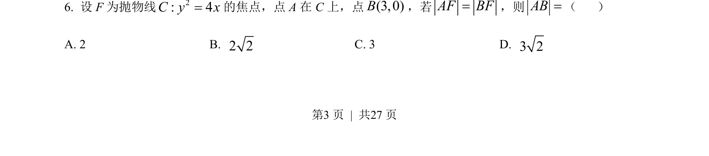

## 题面

## 摘要

已知抛物线焦点和焦半径求点坐标，再计算两点间距离

## 关联考点

- [[227-抛物线|抛物线定义]]
- [[392-点到直线距离公式|点到直线距离公式]]
- [[两点间距离公式]]

## 答案与解析

> 📄 原 PDF 第 3 页：`素材/真题/吉林/2008-2024·（吉林）数学高考真题/2022年高考数学试卷（文）（全国乙卷）（解析卷）.pdf`
