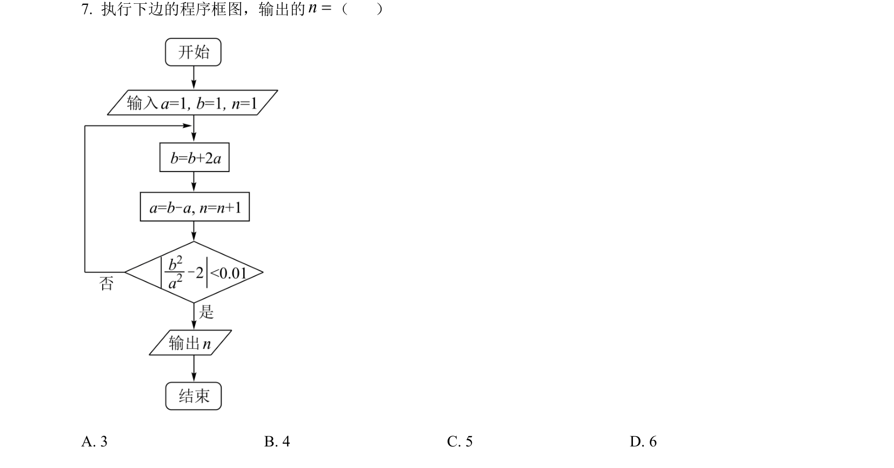
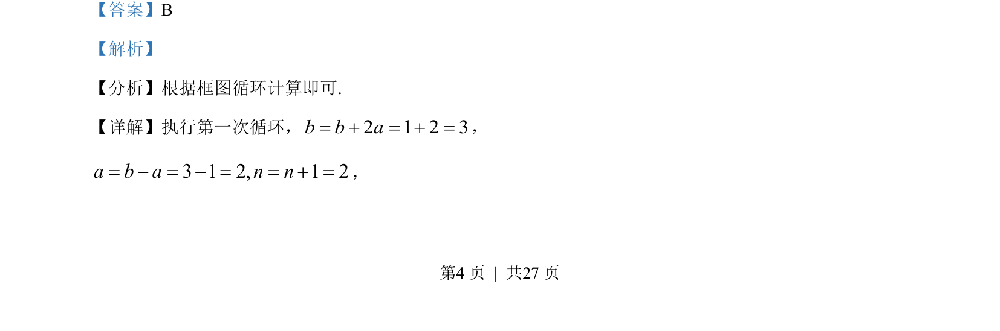
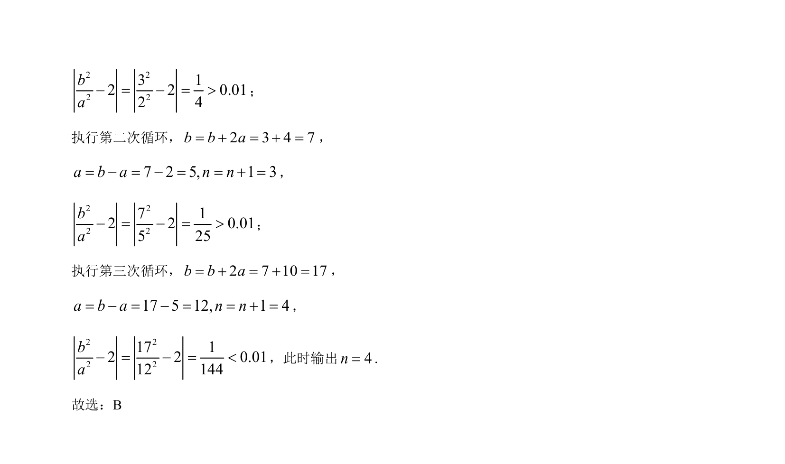

## 题面

## 摘要

本题考查程序框图的循环执行过程，通过模拟计算输出最终满足条件的n值。

## 关联考点

- [[1042-程序框图|程序框图]]
- [[870-循环结构|循环结构]]
- [[916-条件判断|条件判断]]
- [[890-数值计算|数值计算]]

## 答案与解析

> 📄 原 PDF 第 4 页：`素材/真题/吉林/2008-2024·（吉林）数学高考真题/2022年高考数学试卷（文）（全国乙卷）（解析卷）.pdf`
