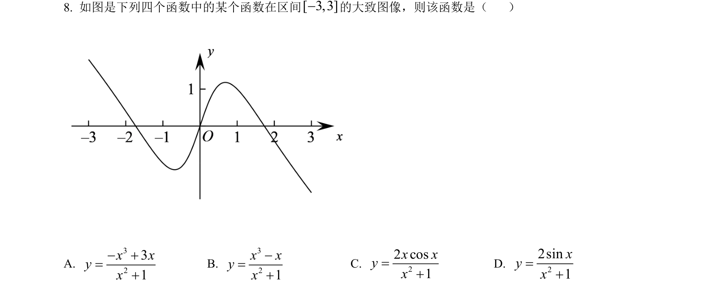
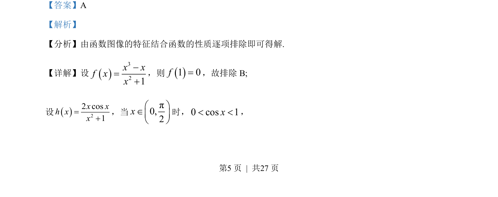
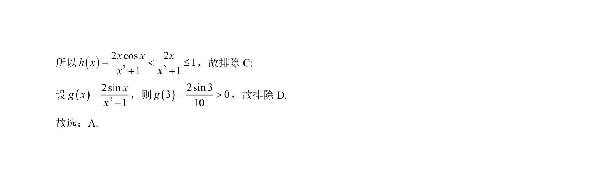

## 题面

## 摘要

本题通过函数性质（如特殊点函数值、不等式放缩）排除错误选项，识别函数图像。

## 关联考点

- [[187-函数图象|函数图像]]
- [[032-除法|排除法]]
- [[1117-赋值|特殊值法]]
- [[453-数列不等式证明|放缩法]]

## 答案与解析

> 📄 原 PDF 第 5 页：`素材/真题/吉林/2008-2024·（吉林）数学高考真题/2022年高考数学试卷（文）（全国乙卷）（解析卷）.pdf`
