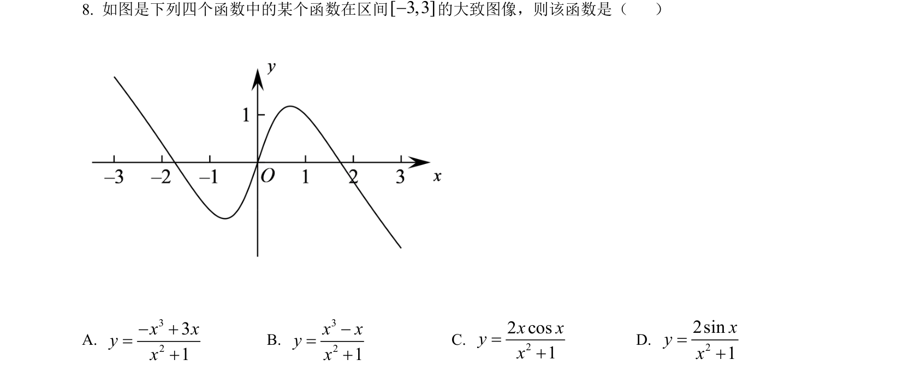
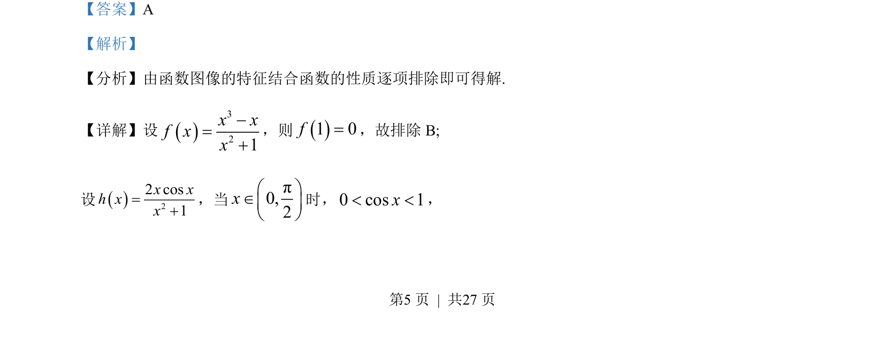
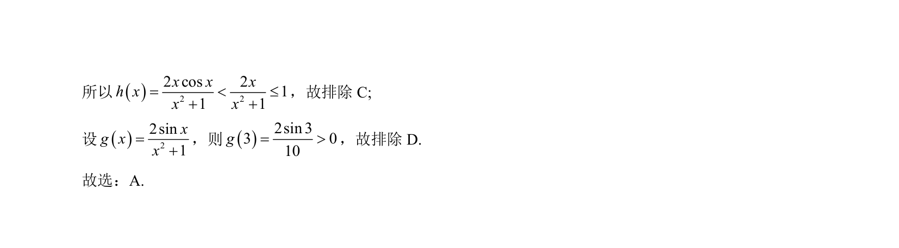

## 题面

## 摘要

本题通过函数性质（如特殊点函数值、不等式放缩）排除错误选项，识别函数图像。

## 关联考点

- [[187-函数图象|函数图像]]
- [[032-除法|排除法]]
- [[1116-赋值|特殊值法]]
- [[453-数列不等式证明|放缩法]]

## 答案与解析

> 📄 原 PDF 第 5 页：`素材/真题/吉林/2008-2024·（吉林）数学高考真题/2022年高考数学试卷（文）（全国乙卷）（解析卷）.pdf`

<!-- 题干文本-start -->
## 题干文本
8. 如图是下列四个函数中的某个函数在区间[ 3,3]-的大致图像，则该函数是（    ）
A. 
3231x xyx- +=+
B. 
321x xyx-=+
C. 22 cos1x xyx=+
D. 22sin1xyx=+
<!-- 题干文本-end -->

<!-- 解析文本-start -->
## 解析文本
【答案】A
【解析】
【分析】由函数图像的特征结合函数的性质逐项排除即可得解.
【详解】设321xxfxx-=+
，则1 0f=，故排除 B;
设22 cos1x xh xx=+，当π0,2xæ öÎç ÷è ø
时，0 cos 1x< <，
<!-- 解析文本-end -->
