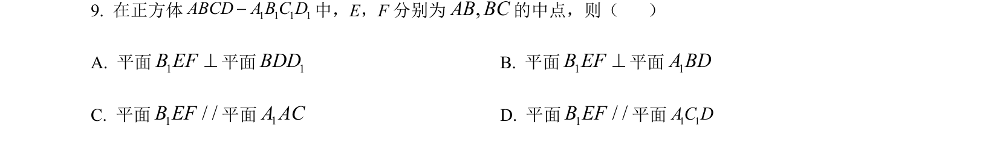
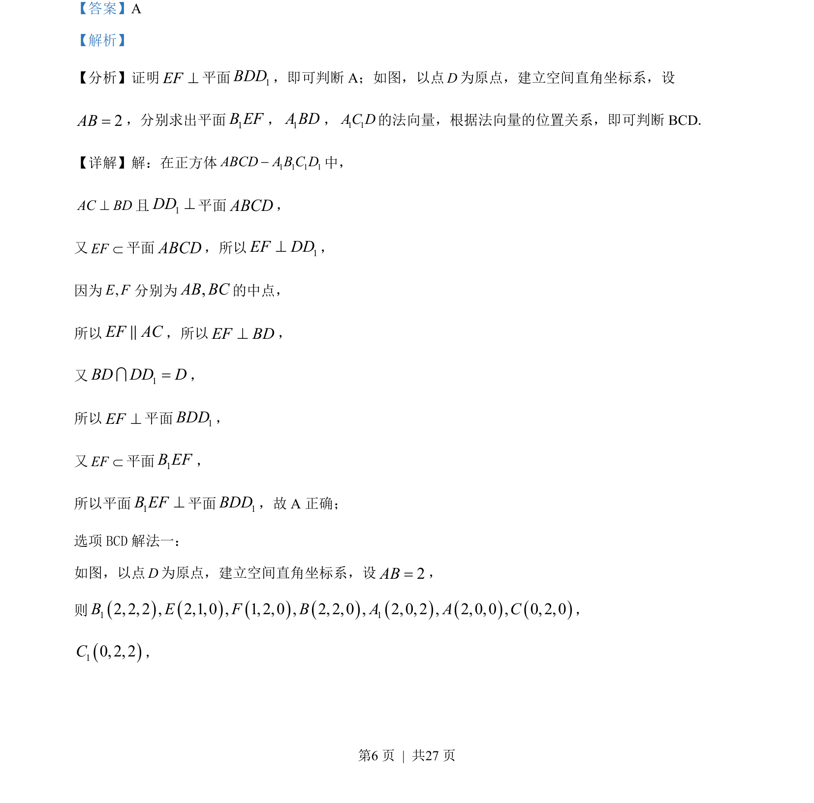
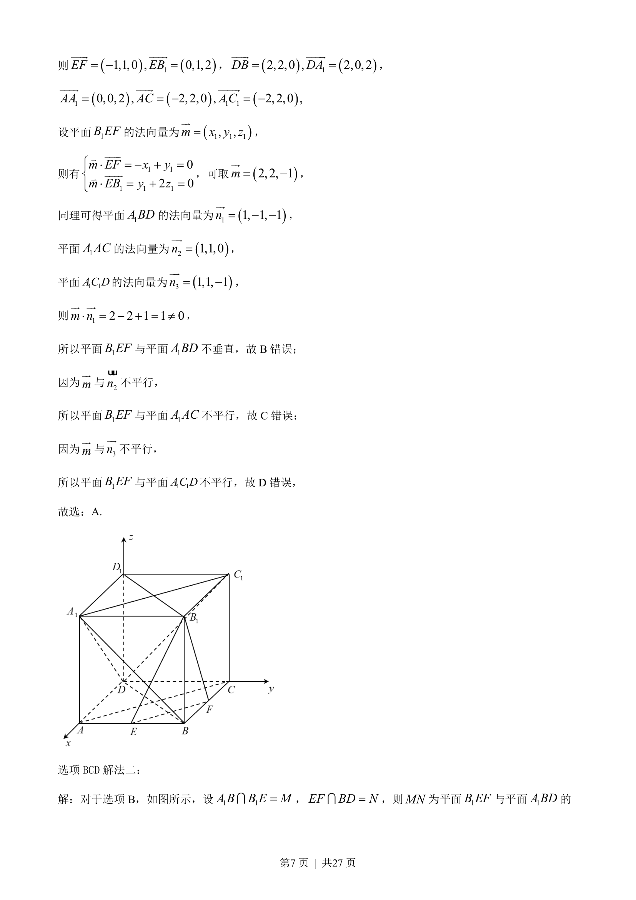
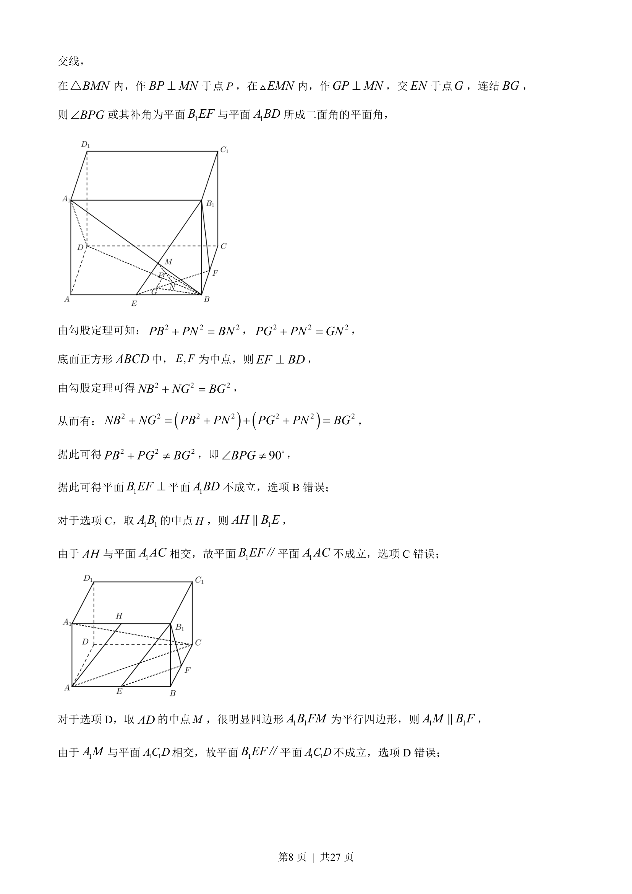
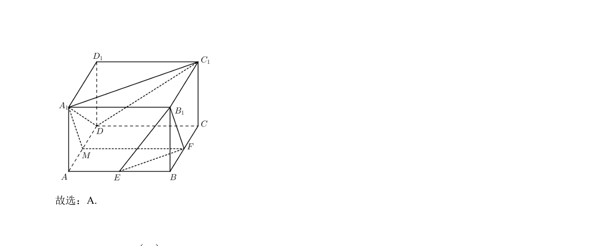

## 题面

## 摘要

正方体ABCD-A₁B₁C₁D₁中E、F分别为AB、BC中点，判断平面B₁EF与各平面的垂直或平行关系。

## 关联考点

- [[立体几何]]
- [[352-空间直线平面平行|线面平行]]
- [[351-空间直线平面垂直|面面垂直]]
- [[352-空间直线平面平行|面面平行]]

## 答案与解析

> 📄 原 PDF 第 6 页：`素材/真题/吉林/2008-2024·（吉林）数学高考真题/2022年高考数学试卷（文）（全国乙卷）（解析卷）.pdf`
